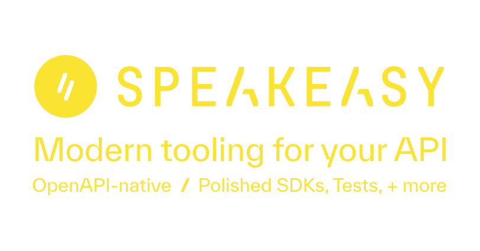

# Additional Features
- `BeforeEach` hook (supported servers: `Echo`)
- Multiple response cookies for strict server (supported servers: `all`)

# `oapi-codegen`

[](https://www.bestpractices.dev/projects/9450)

`oapi-codegen` is a command-line tool and library to convert OpenAPI specifications to Go code, be it [server-side implementations](#generating-server-side-boilerplate), [API clients](#generating-api-clients), or simply [HTTP models](#generating-api-models).

Using `oapi-codegen` allows you to reduce the boilerplate required to create or integrate with services based on [OpenAPI 3.0](https://github.com/OAI/OpenAPI-Specification/blob/main/versions/3.0.0.md), and instead focus on writing your business logic, and working on the real value-add for your organisation.

With `oapi-codegen`, there are a few [Key Design Decisions](#key-design-decisions) we've made, including:

- idiomatic Go, where possible
- fairly simple generated code, erring on the side of duplicate code over nicely refactored code
- supporting as much of OpenAPI 3.x as is possible, alongside Go's type system

`oapi-codegen` is one part of a wider ecosystem, which can be found described in further detail in the [oapi-codegen organisation on GitHub](https://github.com/oapi-codegen).

⚠️ This README may be for the latest development version, which may contain unreleased changes. Please ensure you're looking at the README for the latest release version.

## Action Required: The repository for this project has changed

As announced in [May 2024](https://github.com/oapi-codegen/oapi-codegen/discussions/1605),
we have moved the project from the deepmap organization to our own organization, and you will need to update your
import paths to pull updates past this point. You need to do a recursive search/replace from
`github.com/deepmap/oapi-codegen/v2` to `github.com/oapi-codegen/oapi-codegen/v2`.

> [!IMPORTANT]
> `oapi-codegen` moved to its new home with the version tag `v2.3.0`.

If you are using `v2.2.0` or below, please install like so:

```sh
# for the binary install
go install github.com/deepmap/oapi-codegen/v2/cmd/oapi-codegen@v2.2.0
```

If you are using `v2.3.0` or above, please install like so, using the new module import path:

```sh
# for the binary install
go install github.com/oapi-codegen/oapi-codegen/v2/cmd/oapi-codegen@latest
```

## Install

## For Go 1.24+

It is recommended to follow [the `go tool` support available from Go 1.24+](https://www.jvt.me/posts/2025/01/27/go-tools-124/) for managing the dependency of `oapi-codegen` alongside your core application.

To do this, you run `go get -tool`:

```sh
$ go get -tool github.com/oapi-codegen/oapi-codegen/v2/cmd/oapi-codegen@latest
# this will then modify your `go.mod`
```

From there, each invocation of `oapi-codegen` would be used like so:

```go
//go:generate go tool oapi-codegen -config cfg.yaml ../../api.yaml
```

## Prior to Go 1.24

It is recommended to follow [the `tools.go` pattern](https://www.jvt.me/posts/2022/06/15/go-tools-dependency-management/) for managing the dependency of `oapi-codegen` alongside your core application.

This would give you a `tools/tools.go`:

```go
//go:build tools
// +build tools

package main

import (
	_ "github.com/oapi-codegen/oapi-codegen/v2/cmd/oapi-codegen"
)
```

Then, each invocation of `oapi-codegen` would be used like so:

```go
//go:generate go run github.com/oapi-codegen/oapi-codegen/v2/cmd/oapi-codegen --config=config.yaml ../../api.yaml
```

Alternatively, you can install it as a binary with:

```sh
$ go install github.com/oapi-codegen/oapi-codegen/v2/cmd/oapi-codegen@latest
$ oapi-codegen -version
```

Which then means you can invoke it like so:

```go
//go:generate oapi-codegen --config=config.yaml ../../api.yaml
```

Note that you can also [move your `tools.go` into its own sub-module](https://www.jvt.me/posts/2024/09/30/go-tools-module/) to reduce the impact on your top-level `go.mod`.

### Pinning to commits

While the project does not ([yet](https://github.com/oapi-codegen/oapi-codegen/issues/1519)) have a defined release cadence, there may be cases where you want to pull in yet-unreleased changes to your codebase.

Therefore, you may want to pin your dependency on `oapi-codegen` to a given commit hash, rather than a tag.

This is **officially recommended** for consumers of `oapi-codegen`, who want features/bug fixes that haven't yet been released.

We aim to keep the default branch ready-to-release so you should be able to safely pin.

To do so, you can run:

```sh
# pin to the latest version on the default branch
$ go get github.com/oapi-codegen/oapi-codegen/v2@main
# alternatively, to a commit hash i.e. https://github.com/oapi-codegen/oapi-codegen/commit/71e916c59688a6379b5774dfe5904ec222b9a537
$ go get github.com/oapi-codegen/oapi-codegen/v2@71e916c59688a6379b5774dfe5904ec222b9a537
```

This will then make a change such as:

```diff
diff --git go.mod go.mod
index 44f29a4..436a780 100644
--- go.mod
+++ go.mod
@@ -2,21 +2,20 @@
-require github.com/oapi-codegen/oapi-codegen/v2 v2.1.0
+require github.com/oapi-codegen/oapi-codegen/v2 v2.1.1-0.20240331212514-80f0b978ef16
```

## Usage

`oapi-codegen` is largely configured using a YAML configuration file, to simplify the number of flags that users need to remember, and to make reading the `go:generate` command less daunting.

For full details of what is supported, it's worth checking out [the GoDoc for `codegen.Configuration`](https://pkg.go.dev/github.com/oapi-codegen/oapi-codegen/v2/pkg/codegen#Configuration).

We also have [a JSON Schema](configuration-schema.json) that can be used by IDEs/editors with the Language Server Protocol (LSP) to perform intelligent suggestions, i.e.:

```yaml
# yaml-language-server: $schema=https://raw.githubusercontent.com/oapi-codegen/oapi-codegen/HEAD/configuration-schema.json
package: api
# ...
```

### Backwards compatibility

Although we strive to retain backwards compatibility - as a project that's using a stable API per SemVer - there are sometimes opportunities we must take to fix a bug that could cause a breaking change for [people relying upon the behaviour](https://xkcd.com/1172/).

In this case, we will expose a [compatibility option](https://pkg.go.dev/github.com/oapi-codegen/oapi-codegen/v2/pkg/codegen#CompatibilityOptions) to restore old behaviour.

## Features

At a high level, `oapi-codegen` supports:

- Generating server-side boilerplate for [a number of servers](#supported-servers) ([docs](#generating-server-side-boilerplate))
- Generating client API boilerplate ([docs](#generating-api-clients))
- Generating the types ([docs](#generating-api-models))
- Splitting large OpenAPI specs across multiple packages([docs](#import-mapping))
  - This is also known as "Import Mapping" or "external references" across our documentation / discussion in GitHub issues

## What does it look like?

Below we can see a trimmed down example taken from the OpenAPI Petstore [example](examples/petstore-expanded/stdhttp/api/petstore.gen.go):

```go
// generated code

type ServerInterface interface {
	// ...
	// Returns all pets
	// (GET /pets)
	FindPets(w http.ResponseWriter, r *http.Request, params FindPetsParams)
	// ...
}

// FindPets operation middleware
func (siw *ServerInterfaceWrapper) FindPets(w http.ResponseWriter, r *http.Request) {

	var err error

	// Parameter object where we will unmarshal all parameters from the context
	var params FindPetsParams

	// ------------- Optional query parameter "tags" -------------

	err = runtime.BindQueryParameter("form", true, false, "tags", r.URL.Query(), &params.Tags)
	if err != nil {
		siw.ErrorHandlerFunc(w, r, &InvalidParamFormatError{ParamName: "tags", Err: err})
		return
	}

	// ------------- Optional query parameter "limit" -------------

	err = runtime.BindQueryParameter("form", true, false, "limit", r.URL.Query(), &params.Limit)
	if err != nil {
		siw.ErrorHandlerFunc(w, r, &InvalidParamFormatError{ParamName: "limit", Err: err})
		return
	}

	handler := http.Handler(http.HandlerFunc(func(w http.ResponseWriter, r *http.Request) {
		siw.Handler.FindPets(w, r, params)
	}))

	for _, middleware := range siw.HandlerMiddlewares {
		handler = middleware(handler)
	}

	handler.ServeHTTP(w, r)
}

// HandlerWithOptions creates http.Handler with additional options
func HandlerWithOptions(si ServerInterface, options StdHTTPServerOptions) http.Handler {
	m := options.BaseRouter

	if m == nil {
		m = http.NewServeMux()
	}
	if options.ErrorHandlerFunc == nil {
		options.ErrorHandlerFunc = func(w http.ResponseWriter, r *http.Request, err error) {
			http.Error(w, err.Error(), http.StatusBadRequest)
		}
	}

	wrapper := ServerInterfaceWrapper{
		Handler:            si,
		HandlerMiddlewares: options.Middlewares,
		ErrorHandlerFunc:   options.ErrorHandlerFunc,
	}

	m.HandleFunc("GET "+options.BaseURL+"/pets", wrapper.FindPets)

	return m
}
```

Then, in your own code, you implement the underlying logic for the `FindPets` implementation:

```go
type PetStore struct {
	Pets   map[int64]Pet
	NextId int64
	Lock   sync.Mutex
}

// Make sure we conform to ServerInterface

var _ ServerInterface = (*PetStore)(nil)

func NewPetStore() *PetStore {
	return &PetStore{
		Pets:   make(map[int64]Pet),
		NextId: 1000,
	}
}

// FindPets implements all the handlers in the ServerInterface
func (p *PetStore) FindPets(w http.ResponseWriter, r *http.Request, params FindPetsParams) {
	p.Lock.Lock()
	defer p.Lock.Unlock()

	var result []Pet

	for _, pet := range p.Pets {
		if params.Tags != nil {
			// If we have tags,  filter pets by tag
			for _, t := range *params.Tags {
				if pet.Tag != nil && (*pet.Tag == t) {
					result = append(result, pet)
				}
			}
		} else {
			// Add all pets if we're not filtering
			result = append(result, pet)
		}

		if params.Limit != nil {
			l := int(*params.Limit)
			if len(result) >= l {
				// We're at the limit
				break
			}
		}
	}

	w.WriteHeader(http.StatusOK)
	_ = json.NewEncoder(w).Encode(result)
}
```

As we can see, `oapi-codegen` simplifies some of the boilerplate by taking parameters out of the request and instead allows us to focus on the implementation.

You'll note that there's still a bit more marshaling of request/response data, which is further reduced by using the [Strict server](#strict-server) functionality.

<a name="what-does-it-look-like-strict"></a>
When using the strict server, you'll have the following generated code:

```go
// StrictServerInterface represents all server handlers.
type StrictServerInterface interface {
	// ...
	// Returns all pets
	// (GET /pets)
	FindPets(ctx context.Context, request FindPetsRequestObject) (FindPetsResponseObject, error)
	// ...
}

func NewStrictHandlerWithOptions(ssi StrictServerInterface, middlewares []StrictMiddlewareFunc, options StrictHTTPServerOptions) ServerInterface {
	return &strictHandler{ssi: ssi, middlewares: middlewares, options: options}
}

// FindPets operation middleware
func (sh *strictHandler) FindPets(w http.ResponseWriter, r *http.Request, params FindPetsParams) {
	var request FindPetsRequestObject

	request.Params = params

	handler := func(ctx context.Context, w http.ResponseWriter, r *http.Request, request interface{}) (interface{}, error) {
		return sh.ssi.FindPets(ctx, request.(FindPetsRequestObject))
	}
	for _, middleware := range sh.middlewares {
		handler = middleware(handler, "FindPets")
	}

	response, err := handler(r.Context(), w, r, request)

	if err != nil {
		sh.options.ResponseErrorHandlerFunc(w, r, err)
	} else if validResponse, ok := response.(FindPetsResponseObject); ok {
		if err := validResponse.VisitFindPetsResponse(w); err != nil {
			sh.options.ResponseErrorHandlerFunc(w, r, err)
		}
	} else if response != nil {
		sh.options.ResponseErrorHandlerFunc(w, r, fmt.Errorf("unexpected response type: %T", response))
	}
}
```

Then, in your own code, you implement the underlying logic for the `FindPets` implementation:

```go
// Make sure we conform to StrictServerInterface

var _ StrictServerInterface = (*PetStore)(nil)

func NewPetStore() *PetStore {
	return &PetStore{
		Pets:   make(map[int64]Pet),
		NextId: 1000,
	}
}

// FindPets implements all the handlers in the ServerInterface
func (p *PetStore) FindPets(ctx context.Context, request FindPetsRequestObject) (FindPetsResponseObject, error) {
	p.Lock.Lock()
	defer p.Lock.Unlock()

	var result []Pet

	for _, pet := range p.Pets {
		if request.Params.Tags != nil {
			// If we have tags,  filter pets by tag
			for _, t := range *request.Params.Tags {
				if pet.Tag != nil && (*pet.Tag == t) {
					result = append(result, pet)
				}
			}
		} else {
			// Add all pets if we're not filtering
			result = append(result, pet)
		}

		if request.Params.Limit != nil {
			l := int(*request.Params.Limit)
			if len(result) >= l {
				// We're at the limit
				break
			}
		}
	}

	return FindPets200JSONResponse(result), nil
}
```

We can see that this provides the best means to focus on the implementation of the business logic within the endpoint, rather than (un)marshalling types to and from JSON, or wrangling cookies or headers.

## Key design decisions

- Produce an interface that can be satisfied by your implementation, with reduced boilerplate
- Bulk processing and parsing of OpenAPI document in Go
- Resulting output is using Go's `text/template`s, which are user-overridable
- Attempts to produce Idiomatic Go
- Single-file output
- Support multiple OpenAPI files by having a package-per-OpenAPI file
- Support of OpenAPI 3.0
  - OpenAPI 3.1 support is [awaiting upstream support](https://github.com/oapi-codegen/oapi-codegen/issues/373)
  - Note that this does not include OpenAPI 2.0 (aka Swagger)
- Extract parameters from requests, to reduce work required by your implementation
- Implicit `additionalProperties` are ignored by default ([more details](#additional-properties-additionalproperties))
- Prune unused types by default

## Generating server-side boilerplate

`oapi-codegen` shines by making it fairly straightforward (note that this is a purposeful choice of wording here - we want to avoid words like "easy") to generate the server-side boilerplate for a backend API.

Below you can find the supported servers, and more information about how to implement a server using them.

To provide you a fully Test Driven Development style test harness to confirm you are following the specification, you could use a tool such as [openapi.tanna.dev/go/validator](https://openapi.tanna.dev/go/validator/), or craft your own.

### Supported Servers

Right now, we support the following servers, and are supportive of adding new servers, too!

<table>

<tr>
<th>
Server
</th>
<th>
<code>generate</code> flag to enable code generation
</th>
<th>
Example usage
</th>
</tr>

<tr>
<td>

[Chi](https://github.com/go-chi/chi)

</td>
<td>
<code>chi-server</code>
</td>
<td>


For a Chi server, you will want a configuration file such as:

```yaml
# yaml-language-server: ...
package: api
generate:
  chi-server: true
  models: true
output: gen.go
```

To implement this, check out [the Chi docs](#impl-chi).

</td>
</tr>

<tr>
<td>

[Echo](https://github.com/labstack/echo)

</td>
<td>
<code>echo-server</code>
</td>
<td>

For an Echo server, you will want a configuration file such as:

```yaml
# yaml-language-server: ...
package: api
generate:
  echo-server: true
  models: true
output: gen.go
```

To implement this, check out [the Echo docs](#impl-echo).

</td>
</tr>

<tr>
<td>

[Fiber](https://github.com/gofiber/fiber)

</td>
<td>
<code>fiber-server</code>
</td>

<td>

For a Fiber server, you will want a configuration file such as:

```yaml
# yaml-language-server: ...
package: api
generate:
  fiber-server: true
  models: true
output: gen.go
```

To implement this, check out [the Fiber docs](#impl-fiber).

</td>
</tr>


<tr>
<td>

[Gin](https://github.com/gin-gonic/gin)

</td>
<td>
<code>gin-server</code>
</td>
<td>

For a Gin server, you will want a configuration file such as:

```yaml
# yaml-language-server: ...
package: api
generate:
  gin-server: true
  models: true
output: gen.go
```

To implement this, check out [the Gin docs](#impl-gin).

</td>

</tr>

<tr>
<td>

[gorilla/mux](https://github.com/gorilla/mux)

</td>
<td>
<code>gorilla-server</code>
</td>

<td>

For a gorilla/mux server, you will want a configuration file such as:

```yaml
# yaml-language-server: ...
package: api
generate:
  gorilla-server: true
  models: true
output: gen.go
```

To implement this, check out [the gorilla/mux docs](#impl-gorillamux).

</td>
</tr>

<tr>
<td>

[Iris](https://github.com/kataras/iris)

</td>
<td>
<code>iris-server</code>
</td>

<td>

For a Iris server, you will want a configuration file such as:

```yaml
# yaml-language-server: ...
package: api
generate:
  iris-server: true
  models: true
output: gen.go
```

To implement this, check out [the Iris docs](#impl-iris).

</td>
</tr>

<tr>
<td>

[1.22+ `net/http`](https://pkg.go.dev/net/http)

</td>
<td>
<code>std-http-server</code>
</td>

<td>

To use purely `net/http` (for Go 1.22+), you will want a configuration file such as:

```yaml
# yaml-language-server: ...
package: api
generate:
  std-http-server: true
  models: true
output: gen.go
```

To implement this, check out [the Go 1.22+ `net/http` docs](#impl-stdhttp).

</td>
</tr>

</table>

### Go 1.22+ `net/http`
<a name="impl-stdhttp"></a>

As of Go 1.22, enhancements have been made to the routing of the `net/http` package in the standard library, which makes it a great starting point for implementing a server with, before needing to reach for another router or a full framework.

For instance, let's take this straightforward specification:

```yaml
openapi: "3.0.0"
info:
  version: 1.0.0
  title: Minimal ping API server
paths:
  /ping:
    get:
      responses:
        '200':
          description: pet response
          content:
            application/json:
              schema:
                $ref: '#/components/schemas/Pong'
components:
  schemas:
    # base types
    Pong:
      type: object
      required:
        - ping
      properties:
        ping:
          type: string
          example: pong
```

This then generates code such as:

```go
// Pong defines model for Pong.
type Pong struct {
	Ping string `json:"ping"`
}

// ServerInterface represents all server handlers.
type ServerInterface interface {

	// (GET /ping)
	GetPing(w http.ResponseWriter, r *http.Request)
}

func HandlerFromMux(si ServerInterface, m ServeMux) http.Handler {
	return HandlerWithOptions(si, StdHTTPServerOptions{
		BaseRouter: m,
	})
}

// HandlerWithOptions creates http.Handler with additional options
func HandlerWithOptions(si ServerInterface, options StdHTTPServerOptions) http.Handler {
	m := options.BaseRouter

	// ... omitted for brevity

	m.HandleFunc("GET "+options.BaseURL+"/ping", wrapper.GetPing)

	return m
}
```

To implement this HTTP server, we need to write the following code in our [`api/impl.go`](examples/minimal-server/stdhttp/api/impl.go):

```go
import (
	"encoding/json"
	"net/http"
)

// optional code omitted

type Server struct{}

func NewServer() Server {
	return Server{}
}

// (GET /ping)
func (Server) GetPing(w http.ResponseWriter, r *http.Request) {
	resp := Pong{
		Ping: "pong",
	}

	w.WriteHeader(http.StatusOK)
	_ = json.NewEncoder(w).Encode(resp)
}
```

Now we've got our implementation, we can then write the following code to wire it up and get a running server:

```go
import (
	"log"
	"net/http"

	"github.com/oapi-codegen/oapi-codegen/v2/examples/minimal-server/stdhttp/api"
)

func main() {
	// create a type that satisfies the `api.ServerInterface`, which contains an implementation of every operation from the generated code
	server := api.NewServer()

	r := http.NewServeMux()

	// get an `http.Handler` that we can use
	h := api.HandlerFromMux(server, r)

	s := &http.Server{
		Handler: h,
		Addr:    "0.0.0.0:8080",
	}

	// And we serve HTTP until the world ends.
	log.Fatal(s.ListenAndServe())
}
```

> [!NOTE]
> This doesn't include [validation of incoming requests](#requestresponse-validation-middleware).

> [!NOTE]
> If you feel like you've done everything right, but are still receiving `404 page not found` errors, make sure that you've got the `go` directive in your `go.mod` updated to:

```go.mod
go 1.22
```

</details>

### Chi
<a name="impl-chi"></a>

For instance, let's take this straightforward specification:

```yaml
openapi: "3.0.0"
info:
  version: 1.0.0
  title: Minimal ping API server
paths:
  /ping:
    get:
      responses:
        '200':
          description: pet response
          content:
            application/json:
              schema:
                $ref: '#/components/schemas/Pong'
components:
  schemas:
    # base types
    Pong:
      type: object
      required:
        - ping
      properties:
        ping:
          type: string
          example: pong
```

This then generates code such as:

```go
// Pong defines model for Pong.
type Pong struct {
	Ping string `json:"ping"`
}

// ServerInterface represents all server handlers.
type ServerInterface interface {

	// (GET /ping)
	GetPing(w http.ResponseWriter, r *http.Request)
}

// HandlerFromMux creates http.Handler with routing matching OpenAPI spec based on the provided mux.
func HandlerFromMux(si ServerInterface, r *mux.Router) http.Handler {
	return HandlerWithOptions(si, ChiServerOptions{
		BaseRouter: r,
	})
}

// HandlerWithOptions creates http.Handler with additional options
func HandlerWithOptions(si ServerInterface, options ChiServerOptions) http.Handler {
	r := options.BaseRouter

	// ...

	r.Group(func(r chi.Router) {
		r.Get(options.BaseURL+"/ping", wrapper.GetPing)
	})

	return r
}
```

To implement this HTTP server, we need to write the following code in our [`api/impl.go`](examples/minimal-server/chi/api/impl.go):

```go
import (
	"encoding/json"
	"net/http"
)

// optional code omitted

type Server struct{}

func NewServer() Server {
	return Server{}
}

// (GET /ping)
func (Server) GetPing(w http.ResponseWriter, r *http.Request) {
	resp := Pong{
		Ping: "pong",
	}

	w.WriteHeader(http.StatusOK)
	_ = json.NewEncoder(w).Encode(resp)
}
```

Now we've got our implementation, we can then write the following code to wire it up and get a running server:

```go
import (
	"log"
	"net/http"

	"github.com/oapi-codegen/oapi-codegen/v2/examples/minimal-server/chi/api"
	"github.com/go-chi/chi/v5"
)

func main() {
	// create a type that satisfies the `api.ServerInterface`, which contains an implementation of every operation from the generated code
	server := api.NewServer()

	r := chi.NewMux()

	// get an `http.Handler` that we can use
	h := api.HandlerFromMux(server, r)

	s := &http.Server{
		Handler: h,
		Addr:    "0.0.0.0:8080",
	}

	// And we serve HTTP until the world ends.
	log.Fatal(s.ListenAndServe())
}
```

> [!NOTE]
> This doesn't include [validation of incoming requests](#requestresponse-validation-middleware).

### gorilla/mux
<a name="impl-gorillamux"></a>

For instance, let's take this straightforward specification:

```yaml
openapi: "3.0.0"
info:
  version: 1.0.0
  title: Minimal ping API server
paths:
  /ping:
    get:
      responses:
        '200':
          description: pet response
          content:
            application/json:
              schema:
                $ref: '#/components/schemas/Pong'
components:
  schemas:
    # base types
    Pong:
      type: object
      required:
        - ping
      properties:
        ping:
          type: string
          example: pong
```

This then generates code such as:

```go
// Pong defines model for Pong.
type Pong struct {
	Ping string `json:"ping"`
}

// ServerInterface represents all server handlers.
type ServerInterface interface {

	// (GET /ping)
	GetPing(w http.ResponseWriter, r *http.Request)
}

// HandlerFromMux creates http.Handler with routing matching OpenAPI spec based on the provided mux.
func HandlerFromMux(si ServerInterface, r *mux.Router) http.Handler {
	return HandlerWithOptions(si, GorillaServerOptions{
		BaseRouter: r,
	})
}

// HandlerWithOptions creates http.Handler with additional options
func HandlerWithOptions(si ServerInterface, options GorillaServerOptions) http.Handler {
	r := options.BaseRouter

	// ...

	r.HandleFunc(options.BaseURL+"/ping", wrapper.GetPing).Methods("GET")

	return r
}
```

To implement this HTTP server, we need to write the following code in our [`api/impl.go`](examples/minimal-server/gorillamux/api/impl.go):

```go
import (
	"encoding/json"
	"net/http"
)

// optional code omitted

type Server struct{}

func NewServer() Server {
	return Server{}
}

// (GET /ping)
func (Server) GetPing(w http.ResponseWriter, r *http.Request) {
	resp := Pong{
		Ping: "pong",
	}

	w.WriteHeader(http.StatusOK)
	_ = json.NewEncoder(w).Encode(resp)
}
```

Now we've got our implementation, we can then write the following code to wire it up and get a running server:

```go
import (
	"log"
	"net/http"

	"github.com/oapi-codegen/oapi-codegen/v2/examples/minimal-server/gorillamux/api"
	"github.com/gorilla/mux"
)

func main() {
	// create a type that satisfies the `api.ServerInterface`, which contains an implementation of every operation from the generated code
	server := api.NewServer()

	r := mux.NewRouter()

	// get an `http.Handler` that we can use
	h := api.HandlerFromMux(server, r)

	s := &http.Server{
		Handler: h,
		Addr:    "0.0.0.0:8080",
	}

	// And we serve HTTP until the world ends.
	log.Fatal(s.ListenAndServe())
}
```

> [!NOTE]
> This doesn't include [validation of incoming requests](#requestresponse-validation-middleware).

### Echo server
<a name="impl-echo"></a>

For instance, let's take this straightforward specification:

```yaml
openapi: "3.0.0"
info:
  version: 1.0.0
  title: Minimal ping API server
paths:
  /ping:
    get:
      responses:
        '200':
          description: pet response
          content:
            application/json:
              schema:
                $ref: '#/components/schemas/Pong'
components:
  schemas:
    # base types
    Pong:
      type: object
      required:
        - ping
      properties:
        ping:
          type: string
          example: pong
```

This then generates code such as:

```go
// Pong defines model for Pong.
type Pong struct {
	Ping string `json:"ping"`
}

// ServerInterface represents all server handlers.
type ServerInterface interface {

	// (GET /ping)
	GetPing(ctx echo.Context) error
}

// This is a simple interface which specifies echo.Route addition functions which
// are present on both echo.Echo and echo.Group, since we want to allow using
// either of them for path registration
type EchoRouter interface {
	// ...
	GET(path string, h echo.HandlerFunc, m ...echo.MiddlewareFunc) *echo.Route
	// ...
}

// RegisterHandlers adds each server route to the EchoRouter.
func RegisterHandlers(router EchoRouter, si ServerInterface) {
	RegisterHandlersWithBaseURL(router, si, "")
}

// Registers handlers, and prepends BaseURL to the paths, so that the paths
// can be served under a prefix.
func RegisterHandlersWithBaseURL(router EchoRouter, si ServerInterface, baseURL string) {
	// ...

	router.GET(baseURL+"/ping", wrapper.GetPing)

}
```

To implement this HTTP server, we need to write the following code in our [`api/impl.go`](examples/minimal-server/echo/api/impl.go):

```go
import (
	"net/http"

	"github.com/labstack/echo/v4"
)

// optional code omitted

type Server struct{}

func NewServer() Server {
	return Server{}
}

// (GET /ping)
func (Server) GetPing(ctx echo.Context) error {
	resp := Pong{
		Ping: "pong",
	}

	return ctx.JSON(http.StatusOK, resp)
}
```

Now we've got our implementation, we can then write the following code to wire it up and get a running server:

```go
import (
	"log"

	"github.com/oapi-codegen/oapi-codegen/v2/examples/minimal-server/echo/api"
	"github.com/labstack/echo/v4"
)

func main() {
	// create a type that satisfies the `api.ServerInterface`, which contains an implementation of every operation from the generated code
	server := api.NewServer()

	e := echo.New()

	api.RegisterHandlers(e, server)

	// And we serve HTTP until the world ends.
	log.Fatal(e.Start("0.0.0.0:8080"))
}
```

> [!NOTE]
> This doesn't include [validation of incoming requests](#requestresponse-validation-middleware).

### Fiber server
<a name="impl-fiber"></a>

For instance, let's take this straightforward specification:

```yaml
openapi: "3.0.0"
info:
  version: 1.0.0
  title: Minimal ping API server
paths:
  /ping:
    get:
      responses:
        '200':
          description: pet response
          content:
            application/json:
              schema:
                $ref: '#/components/schemas/Pong'
components:
  schemas:
    # base types
    Pong:
      type: object
      required:
        - ping
      properties:
        ping:
          type: string
          example: pong
```

This then generates code such as:

```go
// Pong defines model for Pong.
type Pong struct {
	Ping string `json:"ping"`
}

// ServerInterface represents all server handlers.
type ServerInterface interface {

	// (GET /ping)
	GetPing(c *fiber.Ctx) error
}

// RegisterHandlers creates http.Handler with routing matching OpenAPI spec.
func RegisterHandlers(router fiber.Router, si ServerInterface) {
	RegisterHandlersWithOptions(router, si, FiberServerOptions{})
}

// RegisterHandlersWithOptions creates http.Handler with additional options
func RegisterHandlersWithOptions(router fiber.Router, si ServerInterface, options FiberServerOptions) {
	// ...

	router.Get(options.BaseURL+"/ping", wrapper.GetPing)
}
```

To implement this HTTP server, we need to write the following code in our [`api/impl.go`](examples/minimal-server/fiber/api/impl.go):

```go
import (
	"net/http"

	"github.com/gofiber/fiber/v2"
)

// ensure that we've conformed to the `ServerInterface` with a compile-time check
var _ ServerInterface = (*Server)(nil)

type Server struct{}

func NewServer() Server {
	return Server{}
}

// (GET /ping)
func (Server) GetPing(ctx *fiber.Ctx) error {
	resp := Pong{
		Ping: "pong",
	}

	return ctx.
		Status(http.StatusOK).
		JSON(resp)
}
```

Now we've got our implementation, we can then write the following code to wire it up and get a running server:

```go
import (
	"log"

	"github.com/oapi-codegen/oapi-codegen/v2/examples/minimal-server/fiber/api"
	"github.com/gofiber/fiber/v2"
)

func main() {
	// create a type that satisfies the `api.ServerInterface`, which contains an implementation of every operation from the generated code
	server := api.NewServer()

	app := fiber.New()

	api.RegisterHandlers(app, server)

	// And we serve HTTP until the world ends.
	log.Fatal(app.Listen("0.0.0.0:8080"))
}
```

> [!NOTE]
> This doesn't include [validation of incoming requests](#requestresponse-validation-middleware).

### Gin server
<a name="impl-gin"></a>

For instance, let's take this straightforward specification:

```yaml
openapi: "3.0.0"
info:
  version: 1.0.0
  title: Minimal ping API server
paths:
  /ping:
    get:
      responses:
        '200':
          description: pet response
          content:
            application/json:
              schema:
                $ref: '#/components/schemas/Pong'
components:
  schemas:
    # base types
    Pong:
      type: object
      required:
        - ping
      properties:
        ping:
          type: string
          example: pong
```

This then generates code such as:

```go
// Pong defines model for Pong.
type Pong struct {
	Ping string `json:"ping"`
}

// ServerInterface represents all server handlers.
type ServerInterface interface {

	// (GET /ping)
	GetPing(c *gin.Context)
}

// RegisterHandlers creates http.Handler with routing matching OpenAPI spec.
func RegisterHandlers(router gin.IRouter, si ServerInterface) {
	RegisterHandlersWithOptions(router, si, GinServerOptions{})
}

// RegisterHandlersWithOptions creates http.Handler with additional options
func RegisterHandlersWithOptions(router gin.IRouter, si ServerInterface, options GinServerOptions) {
	// ...

	router.GET(options.BaseURL+"/ping", wrapper.GetPing)
}
```

To implement this HTTP server, we need to write the following code in our [`api/impl.go`](examples/minimal-server/gorillamux/api/impl.go):

```go
import (
	"net/http"

	"github.com/gin-gonic/gin"
)

// optional code omitted

type Server struct{}

func NewServer() Server {
	return Server{}
}

// (GET /ping)
func (Server) GetPing(ctx *gin.Context) {
	resp := Pong{
		Ping: "pong",
	}

	ctx.JSON(http.StatusOK, resp)
}
```

Now we've got our implementation, we can then write the following code to wire it up and get a running server:

```go
import (
	"log"
	"net/http"

	"github.com/oapi-codegen/oapi-codegen/v2/examples/minimal-server/gin/api"
	"github.com/gin-gonic/gin"
)

func main() {
	// create a type that satisfies the `api.ServerInterface`, which contains an implementation of every operation from the generated code
	server := api.NewServer()

	r := gin.Default()

	api.RegisterHandlers(r, server)

	// And we serve HTTP until the world ends.

	s := &http.Server{
		Handler: r,
		Addr:    "0.0.0.0:8080",
	}

	// And we serve HTTP until the world ends.
	log.Fatal(s.ListenAndServe())
}
```

> [!NOTE]
> This doesn't include [validation of incoming requests](#requestresponse-validation-middleware).

### Iris server
<a name="impl-iris"></a>

For instance, let's take this straightforward specification:

```yaml
openapi: "3.0.0"
info:
  version: 1.0.0
  title: Minimal ping API server
paths:
  /ping:
    get:
      responses:
        '200':
          description: pet response
          content:
            application/json:
              schema:
                $ref: '#/components/schemas/Pong'
components:
  schemas:
    # base types
    Pong:
      type: object
      required:
        - ping
      properties:
        ping:
          type: string
          example: pong
```

This then generates code such as:

```go
// Pong defines model for Pong.
type Pong struct {
	Ping string `json:"ping"`
}

// ServerInterface represents all server handlers.
type ServerInterface interface {

	// (GET /ping)
	GetPing(ctx iris.Context)
}

// RegisterHandlers creates http.Handler with routing matching OpenAPI spec.
func RegisterHandlers(router *iris.Application, si ServerInterface) {
	RegisterHandlersWithOptions(router, si, IrisServerOptions{})
}

// RegisterHandlersWithOptions creates http.Handler with additional options
func RegisterHandlersWithOptions(router *iris.Application, si ServerInterface, options IrisServerOptions) {
	// ...

	router.Get(options.BaseURL+"/ping", wrapper.GetPing)

	router.Build()
}
```

To implement this HTTP server, we need to write the following code in our [`api/impl.go`](examples/minimal-server/gorillamux/api/impl.go):

```go
import (
	"net/http"

	"github.com/kataras/iris/v12"
)

// optional code omitted

type Server struct{}

func NewServer() Server {
	return Server{}
}

// (GET /ping)
func (Server) GetPing(ctx iris.Context) {
	resp := Pong{
		Ping: "pong",
	}

	ctx.StatusCode(http.StatusOK)
	_ = ctx.JSON(resp)
}
```

Now we've got our implementation, we can then write the following code to wire it up and get a running server:

```go
import (
	"log"

	"github.com/oapi-codegen/oapi-codegen/v2/examples/minimal-server/iris/api"
	"github.com/kataras/iris/v12"
)

func main() {
	// create a type that satisfies the `api.ServerInterface`, which contains an implementation of every operation from the generated code
	server := api.NewServer()

	i := iris.Default()

	api.RegisterHandlers(i, server)

	// And we serve HTTP until the world ends.
	log.Fatal(i.Listen("0.0.0.0:8080"))
}
```

> [!NOTE]
> This doesn't include [validation of incoming requests](#requestresponse-validation-middleware).

### Strict server

`oapi-codegen` also supports generating a server that is much more strict with the contract that the implementer requires, and takes inspiration from server-side code generation for RPC servers.

This takes the boilerplate reduction from the non-strict servers and adds additional boilerplate reduction, allowing you to make the following changes to your function signatures:

```diff
-FindPets(w http.ResponseWriter, r *http.Request, params FindPetsParams)
+FindPets(ctx context.Context, request FindPetsRequestObject) (FindPetsResponseObject, error)
```

This is the highest level of strictness that `oapi-codegen` supports right now, and it's a good idea to start with this if you want the most guardrails to simplify developing your APIs.

The strict server has support for:

- multiple request/response media types and status codes on a given operation
- first-class support for `multipart/form-data` and `application/x-www-form-urlencoded` requests
- returning an [HTTP 500 Internal Server Error](https://http.cat/500), when an `error` is returned from a function
- automagic (un)marshalling of request/responses, and setting `content-type` and HTTP status codes on responses
- binding request values to a struct, a `multipart.Reader` or providing a `io.Reader`

You can see a little more detail of the generated code in the ["What does it look like"](#what-does-it-look-like-strict) section.

> [!NOTE]
> To configure the strict server generation, you must specify another server to be generated. For instance:

```yaml
# yaml-language-server: $schema=https://raw.githubusercontent.com/oapi-codegen/oapi-codegen/HEAD/configuration-schema.json
package: api
generate:
  # NOTE another server must be added!
  chi-server: true
  strict-server: true
output: server.gen.go
```

> [!NOTE]
> This doesn't include [validation of incoming requests](#requestresponse-validation-middleware).

## Generating API clients

As well as generating the server-side boilerplate, `oapi-codegen` can also generate API clients.

This aims to be an API client that can be used to interact with the methods of the API, and is perfectly suited for production usage.

However, if you were looking for a slightly more SDK-style approach, or a mix of generated tests and/or documentation, this API client may not be for you, and you may want to look at alternate tooling.

For instance, given an `api.yaml`:

```yaml
openapi: "3.0.0"
info:
  version: 1.0.0
  title: Generate models
paths:
  /client:
    get:
      operationId: getClient
      responses:
        200:
          content:
            application/json:
              schema:
                $ref: "#/components/schemas/ClientType"
    put:
      operationId: updateClient
      responses:
        400:
          content:
            application/json:
              schema:
                type: object
                properties:
                  code:
                    type: string
                required:
                - code
components:
  schemas:
    ClientType:
      type: object
      required:
        - name
      properties:
        name:
          type: string
    # NOTE that this is not generated by default because it's not referenced. If you want it, you need to use the following YAML configuration:
    #
    # output-options:
    #   skip-prune: true
    Unreferenced:
      type: object
      required:
        - id
      properties:
        id:
          type: integer
```

And a `cfg.yaml`:

```yaml
# yaml-language-server: $schema=https://raw.githubusercontent.com/oapi-codegen/oapi-codegen/HEAD/configuration-schema.json
package: client
output: client.gen.go
generate:
  models: true
  client: true
```

And a `generate.go`:

```go
package client

//go:generate go run github.com/oapi-codegen/oapi-codegen/v2/cmd/oapi-codegen -config cfg.yaml api.yaml
```

This would then generate:

```go
package client

// ...

// ClientType defines model for ClientType.
type ClientType struct {
	Name string `json:"name"`
}

// ...

// Client which conforms to the OpenAPI3 specification for this service.
type Client struct {
	// The endpoint of the server conforming to this interface, with scheme,
	// https://api.deepmap.com for example. This can contain a path relative
	// to the server, such as https://api.deepmap.com/dev-test, and all the
	// paths in the swagger spec will be appended to the server.
	Server string

	// Doer for performing requests, typically a *http.Client with any
	// customized settings, such as certificate chains.
	Client HttpRequestDoer

	// A list of callbacks for modifying requests which are generated before sending over
	// the network.
	RequestEditors []RequestEditorFn
}

// ...

// The interface specification for the client above.
type ClientInterface interface {
	// GetClient request
	GetClient(ctx context.Context, reqEditors ...RequestEditorFn) (*http.Response, error)

	// UpdateClient request
	UpdateClient(ctx context.Context, reqEditors ...RequestEditorFn) (*http.Response, error)
}

// ...

// ClientWithResponsesInterface is the interface specification for the client with responses above.
type ClientWithResponsesInterface interface {
	// GetClientWithResponse request
	GetClientWithResponse(ctx context.Context, reqEditors ...RequestEditorFn) (*GetClientResponse, error)

	// UpdateClientWithResponse request
	UpdateClientWithResponse(ctx context.Context, reqEditors ...RequestEditorFn) (*UpdateClientResponse, error)
}

type GetClientResponse struct {
	Body         []byte
	HTTPResponse *http.Response
	JSON200      *ClientType
}

// ...
```

With this generated client, it is then possible to construct and utilise the client, for instance:

```go
package client_test

import (
	"context"
	"fmt"
	"log"
	"net/http"

	"github.com/oapi-codegen/oapi-codegen/v2/examples/client"
)

func TestClient_canCall() {
	// custom HTTP client
	hc := http.Client{}

	// with a raw http.Response
	{
		c, err := client.NewClient("http://localhost:1234", client.WithHTTPClient(&hc))
		if err != nil {
			log.Fatal(err)
		}

		resp, err := c.GetClient(context.TODO())
		if err != nil {
			log.Fatal(err)
		}
		if resp.StatusCode != http.StatusOK {
			log.Fatalf("Expected HTTP 200 but received %d", resp.StatusCode)
		}
	}

	// or to get a struct with the parsed response body
	{
		c, err := client.NewClientWithResponses("http://localhost:1234", client.WithHTTPClient(&hc))
		if err != nil {
			log.Fatal(err)
		}

		resp, err := c.GetClientWithResponse(context.TODO())
		if err != nil {
			log.Fatal(err)
		}
		if resp.StatusCode() != http.StatusOK {
			log.Fatalf("Expected HTTP 200 but received %d", resp.StatusCode())
		}

		fmt.Printf("resp.JSON200: %v\n", resp.JSON200)
	}

}
```

## Generating API models

If you're looking to only generate the models for interacting with a remote service, for instance if you need to hand-roll the API client for whatever reason, you can do this as-is.

> [!TIP]
> Try to define as much as possible within the `#/components/schemas` object, as `oapi-codegen` will generate all the types here.
>
> Although we can generate some types based on inline definitions in i.e. a path's response type, it isn't always possible to do this, or if it is generated, can be a little awkward to work with as it may be defined as an anonymous struct.

For instance, given an `api.yaml`:

```yaml
openapi: "3.0.0"
info:
  version: 1.0.0
  title: Generate models
paths:
  /client:
    get:
      operationId: getClient
      responses:
        200:
          content:
            application/json:
              schema:
                # NOTE that Client is generated here, because it's within #/components/schemas
                $ref: "#/components/schemas/Client"
    put:
      operationId: updateClient
      responses:
        400:
          content:
            application/json:
              # NOTE that this anonymous object is /not/ generated because it's an anonymous, but would be generated if using `generate: client`
              # See https://github.com/oapi-codegen/oapi-codegen/issues/1512
              schema:
                type: object
                properties:
                  code:
                    type: string
                required:
                - code
components:
  schemas:
    Client:
      type: object
      required:
        - name
      properties:
        name:
          type: string
    # NOTE that this is not generated by default because it's not referenced. If you want it, you need to use the following YAML configuration:
    #
    # output-options:
    #   skip-prune: true
    Unreferenced:
      type: object
      required:
        - id
      properties:
        id:
          type: integer
```

And a `cfg.yaml`:

```yaml
# yaml-language-server: $schema=https://raw.githubusercontent.com/oapi-codegen/oapi-codegen/HEAD/configuration-schema.json
package: onlymodels
output: only-models.gen.go
generate:
  models: true
```

And a `generate.go`:

```go
package onlymodels

//go:generate go run github.com/oapi-codegen/oapi-codegen/v2/cmd/oapi-codegen -config cfg.yaml api.yaml
```

This would then generate:

```go
package onlymodels

// Client defines model for Client.
type Client struct {
	Name string `json:"name"`
}
```

If you wish to also generate the `Unreferenced` type, you would need the following `cfg.yaml`:

```yaml
# yaml-language-server: $schema=https://raw.githubusercontent.com/oapi-codegen/oapi-codegen/HEAD/configuration-schema.json
package: onlymodels
output: only-models.gen.go
generate:
  models: true
output-options:
  # NOTE that this is only required for the `Unreferenced` type
  skip-prune: true
```

For a complete example see [`examples/only-models`](examples/only-models).

## Splitting large OpenAPI specs across multiple packages (aka "Import Mapping" or "external references")
<a name=import-mapping></a>

When you've got a large OpenAPI specification, you may find it useful to split the contents of the spec across multiple files, using external references, such as:

```yaml
      responses:
        200:
          description: Success
          content:
            application/json:
              schema:
                $ref: '#/components/schemas/User'
```

This is supported by `oapi-codegen`, through the ability to perform "Import Mapping".

For instance, let's say that we have a large API, which has a user-facing API and an admin API, both of which use a common set of API models.

In this case, we may have an Admin API that looks like:

```yaml
# admin/api.yaml
openapi: "3.0.0"
info:
  version: 1.0.0
  title: Admin API
  description: The admin-only portion of the API, which has its own separate OpenAPI spec
tags:
  - name: admin
    description: Admin API endpoints
  - name: user
    description: API endpoint that pertains to user data
paths:
  /admin/user/{id}:
    get:
      tags:
        - admin
        - user
      summary: Get a user's details
      operationId: getUserById
      parameters:
        - name: id
          in: path
          required: true
          schema:
            type: string
            format: uuid
      responses:
        200:
          description: Success
          content:
            application/json:
              schema:
                $ref: '../common/api.yaml#/components/schemas/User'
```

This references the common spec:

```yaml
# common/api.yaml
components:
  schemas:
    User:
      type: object
      additionalProperties: false
      properties:
        name:
          type: string
      required:
        - name
```

So how do we get `oapi-codegen` to generate our code?

### Using a single package with multiple OpenAPI specs

<a name=import-mapping-self></a>

> [!TIP]
> Since `oapi-codegen` v2.4.0, it is now possible to split large OpenAPI specifications into the same Go package, using the "self" mapping (denoted by a `-`) when using Import Mapping.
>
> This is an improvement on the previous model, which would require splitting files across multiple packages.

> [!NOTE]
> You still need to have multiple `go generate`s, and any other configuration files.

To get `oapi-codegen`'s single-package support working, we need multiple calls to `oapi-codegen`, one call per OpenAPI spec file:

```sh
$ go run github.com/oapi-codegen/oapi-codegen/v2/cmd/oapi-codegen -config cfg-api.yaml ../admin/api.yaml
$ go run github.com/oapi-codegen/oapi-codegen/v2/cmd/oapi-codegen -config cfg-user.yaml ../common/api.yaml
```

This therefore means that we need multiple configuration files, such as `cfg-api.yaml`:

```yaml
# yaml-language-server: $schema=https://raw.githubusercontent.com/oapi-codegen/oapi-codegen/HEAD/configuration-schema.json
package: samepackage
output: server.gen.go
generate:
  models: true
  chi-server: true
  strict-server: true
output-options:
  # to make sure that all types are generated
  skip-prune: true
import-mapping:
  user.yaml: "-"
```

And then our `cfg-user.yaml`:

```yaml
# yaml-language-server: $schema=https://raw.githubusercontent.com/oapi-codegen/oapi-codegen/HEAD/configuration-schema.json
package: samepackage
output: user.gen.go
generate:
  models: true
output-options:
  # to make sure that all types are generated
  skip-prune: true
```

From here, `oapi-codegen` will generate multiple Go files, all within the same package, which can be used to break down your large OpenAPI specifications, and generate only the subsets of code needed for each part of the spec.

Check out [the import-mapping/samepackage example](examples/import-mapping/samepackage) for the full code.

### Using multiple packages, with one OpenAPI spec per package

To get `oapi-codegen`'s multi-package support working, we need to set up our directory structure:

```
├── admin
│   ├── cfg.yaml
│   └── generate.go
└── common
    ├── cfg.yaml
    └── generate.go
```

We could start with our configuration file for our admin API spec:

```yaml
# yaml-language-server: $schema=https://raw.githubusercontent.com/oapi-codegen/oapi-codegen/HEAD/configuration-schema.json
# admin/cfg.yaml
package: admin
output: server.gen.go
generate:
  models: true
  chi-server: true
output-options:
  # to make sure that all types are generated
  skip-prune: true
# NOTE that this won't work, as it's missing `import-mapping`
```

If we were to run `oapi-codegen`, this will fail with the following error

```
error generating code: error creating operation definitions: error generating response definitions: error generating request body definition: error turning reference (../common/api.yaml#/components/schemas/User) into a Go type: unrecognized external reference '../common/api.yaml'; please provide the known import for this reference using option --import-mapping
```

This is because `oapi-codegen` requires the `import-mapping`:

```yaml
# yaml-language-server: $schema=https://raw.githubusercontent.com/oapi-codegen/oapi-codegen/HEAD/configuration-schema.json
package: admin
output: server.gen.go
generate:
  models: true
  chi-server: true
output-options:
  # to make sure that all types are generated
  skip-prune: true
import-mapping:
  # for a given file/URL that is $ref'd, point `oapi-codegen` to the Go package that this spec is generated into, to perform Go package imports
  ../common/api.yaml: github.com/oapi-codegen/oapi-codegen/v2/examples/import-mapping/common
```

This will then generate the following code:

```go
package admin

import (
	// ...
	externalRef0 "github.com/oapi-codegen/oapi-codegen/v2/examples/import-mapping/common"
)

// User defines model for User.
type User = externalRef0.User
```

If you don't want to do this, an alternate option is to [use a single package, with multiple OpenAPI spec files for that given package](#import-mapping-self) or to [bundle your multiple OpenAPI files](https://www.jvt.me/posts/2022/02/10/bundle-openapi/) into a single spec.

Check out [the import-mapping/multiplepackages example](examples/import-mapping/multiplepackages/) for the full code.

## Modifying the input OpenAPI Specification

Prior to `oapi-codegen` v2.4.0, users wishing to override specific configuration, for instance taking advantage of extensions such as `x-go-type`  would need to modify the OpenAPI specification they are using.

In a lot of cases, this OpenAPI specification would be produced by a different team to the consumers (or even a different company) and so asking them to make changes like this were unreasonable.

This would lead to the API consumers needing to vendor the specification from the producer (which is [our recommendation anyway](#https-paths)) and then make any number of local changes to the specification to make it generate code that looks reasonable.

However, in the case that a consumer would update their specification, they would likely end up with a number of merge conflicts.

Now, as of `oapi-codegen` v2.4.0, it is now possible to make changes to the input OpenAPI specification _without needing to modify it directly_.

This takes advantage of the [OpenAPI Overlay specification](https://github.com/OAI/Overlay-Specification), which is a stable specification.

> [!CAUTION]
> Beware! Here (may) be dragons.
>
> The Overlay specification requires the use of JSON Path, which some users may find difficult to write and/or maintain.
>
> We still heavily recommend using Overlay functionality, but would like users to be aware of this.
>
> There is a [proposed modification to the specification](https://github.com/OAI/Overlay-Specification/pull/32) which would relax the need for JSON Path as the targeting mechanism.

For instance, let's say that we have the following OpenAPI specification, which provides insight into an internal endpoint that we should not be generating any code for (denoted by `x-internal`):

```yaml
openapi: "3.0.0"
info:
  version: 1.0.0
  title: "Example to indicate how to use the OpenAPI Overlay specification (https://github.com/OAI/Overlay-Specification)"
paths:
  /ping:
    get:
      responses:
        '200':
          description: pet response
          content:
            application/json:
              schema:
                $ref: '#/components/schemas/Pong'
    delete:
      x-internal: true
      responses:
        '202':
          content: {}
```

If we were to run `oapi-codegen` with out-of-the-box functionality, this would then lead to the DELETE endpoint being generated, which we don't want.

Instead, we can define the following `overlay.yaml`:


```yaml
overlay: 1.0.0
info:
  title: Overlay
  version: 0.0.0
actions:
- target: "$"
  description: Perform a structural overlay, which can be more readable, as it's clear what the shape of the document is
  update:
    info:
      x-overlay-applied: structured-overlay
    paths:
      /ping:
        get:
          responses:
            '200':
              description: Perform a ping request
- target: $.paths.*[?(@.x-internal)]
  description: Remove internal endpoints (noted by x-internal)
  remove: true
- target: $.paths.*.*[?(@.x-internal)]
  description: Remove internal endpoints (noted by x-internal)
  remove: true
```

And our configuration file for `oapi-codegen`:

```yaml
# yaml-language-server: $schema=https://raw.githubusercontent.com/oapi-codegen/oapi-codegen/HEAD/configuration-schema.json
package: api
output: ping.gen.go
generate:
  models: true
  gorilla-server: true
  embedded-spec: true
output-options:
  overlay:
    path: overlay.yaml
```

This then completely removes the DELETE endpoint _before_ we even start to parse the specification in `oapi-codegen`, so it's as if your specification was provided without that endpoint.

Additionally, we can override other pieces of metadata, such as the description for operations.

Check out [the overlay example](examples/overlay/) for the full code, and some more complex examples.

## Generating Nullable types

It's possible that you want to be able to determine whether a field isn't sent, is sent as `null` or has a value.

For instance, if you had the following OpenAPI property:

```yaml
S:
  type: object
  properties:
    Field:
      type: string
      nullable: true
    required: []
```

The default behaviour in `oapi-codegen` is to generate:

```go
type S struct {
	Field *string `json:"field,omitempty"`
}
```

However, you lose the ability to understand the three cases, as there's no way to distinguish two of the types from each other:

- is this field not sent? (Can be checked with `S.Field == nil`)
- is this field `null`? (Can be checked with `S.Field == nil`)
- does this field have a value? (`S.Field != nil && *S.Field == "123"`)

As of `oapi-codegen` [v2.1.0](https://github.com/oapi-codegen/oapi-codegen/releases/tag/v2.1.0) it is now possible to represent this with the `nullable.Nullable` type from [our new library, oapi-codegen/nullable](https://github.com/oapi-codegen/nullable).

If you configure your generator's Output Options to opt-in to this behaviour, as so:

```yaml
output-options:
  nullable-type: true
```

You will now receive the following output:

```go
type S struct {
    // note that there's no pointer here, just `omitempty`
    Field nullable.Nullable[string] `json:"field,omitempty"`
}
```

## OpenAPI extensions

As well as the core OpenAPI support, we also support the following OpenAPI extensions, as denoted by the [OpenAPI Specification Extensions](https://spec.openapis.org/oas/v3.0.3#specification-extensions).

<table>

<tr>
<th>
Extension
</th>
<th>
Description
</th>
<th>
Example usage
</th>
</tr>

<tr>
<td>

`x-go-type` <br>
`x-go-type-import`

</td>
<td>
Override the generated type definition (and optionally, add an import from another package)
</td>
<td>
<details>

Using the `x-go-type` (and optionally, `x-go-type-import` when you need to import another package) allows overriding the type that `oapi-codegen` determined the generated type should be.

We can see this at play with the following schemas:

```yaml
components:
  schemas:
    Client:
      type: object
      required:
        - name
      properties:
        name:
          type: string
        id:
          type: number
    ClientWithExtension:
      type: object
      required:
        - name
      properties:
        name:
          type: string
          # this is a bit of a contrived example, as you could instead use
          # `format: uuid` but it explains how you'd do this when there may be
          # a clash, for instance if you already had a `uuid` package that was
          # being imported, or ...
          x-go-type: googleuuid.UUID
          x-go-type-import:
            path: github.com/google/uuid
            name: googleuuid
        id:
          type: number
          # ... this is also a bit of a contrived example, as you could use
          # `type: integer` but in the case that you know better than what
          # oapi-codegen is generating, like so:
          x-go-type: int64
```

From here, we now get two different models:

```go
// Client defines model for Client.
type Client struct {
	Id   *float32 `json:"id,omitempty"`
	Name string   `json:"name"`
}

// ClientWithExtension defines model for ClientWithExtension.
type ClientWithExtension struct {
	Id   *int64          `json:"id,omitempty"`
	Name googleuuid.UUID `json:"name"`
}
```

You can see this in more detail in [the example code](examples/extensions/xgotype/).

</details>
</td>
</tr>

<tr>
<td>

`x-go-type-skip-optional-pointer`

</td>
<td>
Do not add a pointer type for optional fields in structs
</td>
<td>
<details>

By default, `oapi-codegen` will generate a pointer for optional fields.

Using the `x-go-type-skip-optional-pointer` extension allows omitting that pointer.

We can see this at play with the following schemas:

```yaml
components:
  schemas:
    Client:
      type: object
      required:
        - name
      properties:
        name:
          type: string
        id:
          type: number
    ClientWithExtension:
      type: object
      required:
        - name
      properties:
        name:
          type: string
        id:
          type: number
          x-go-type-skip-optional-pointer: true
```

From here, we now get two different models:

```go
// Client defines model for Client.
type Client struct {
	Id   *float32 `json:"id,omitempty"`
	Name string   `json:"name"`
}

// ClientWithExtension defines model for ClientWithExtension.
type ClientWithExtension struct {
	Id   float32 `json:"id,omitempty"`
	Name string  `json:"name"`
}
```

You can see this in more detail in [the example code](examples/extensions/xgotypeskipoptionalpointer/).

</details>
</td>
</tr>

<tr>
<td>

`x-go-name`

</td>
<td>
Override the generated name of a field or a type
</td>
<td>
<details>

By default, `oapi-codegen` will attempt to generate the name of fields and types in as best a way it can.

However, sometimes, the name doesn't quite fit what your codebase standards are, or the intent of the field, so you can override it with `x-go-name`.

We can see this at play with the following schemas:

```yaml
openapi: "3.0.0"
info:
  version: 1.0.0
  title: x-go-name
components:
  schemas:
    Client:
      type: object
      required:
        - name
      properties:
        name:
          type: string
        id:
          type: number
    ClientWithExtension:
      type: object
      # can be used on a type
      x-go-name: ClientRenamedByExtension
      required:
        - name
      properties:
        name:
          type: string
        id:
          type: number
          # or on a field
          x-go-name: AccountIdentifier
```

From here, we now get two different models:

```go
// Client defines model for Client.
type Client struct {
	Id   *float32 `json:"id,omitempty"`
	Name string   `json:"name"`
}

// ClientRenamedByExtension defines model for ClientWithExtension.
type ClientRenamedByExtension struct {
	AccountIdentifier *float32 `json:"id,omitempty"`
	Name              string   `json:"name"`
}
```

You can see this in more detail in [the example code](examples/extensions/xgoname/).

</details>
</td>
</tr>

<tr>
<td>

`x-go-type-name`

</td>
<td>
Override the generated name of a type
</td>
<td>
<details>

> [!NOTE]
> Notice that this is subtly different to the `x-go-name`, which also applies to _fields_ within `struct`s.

By default, `oapi-codegen` will attempt to generate the name of types in as best a way it can.

However, sometimes, the name doesn't quite fit what your codebase standards are, or the intent of the field, so you can override it with `x-go-name`.

We can see this at play with the following schemas:

```yaml
openapi: "3.0.0"
info:
  version: 1.0.0
  title: x-go-type-name
components:
  schemas:
    Client:
      type: object
      required:
        - name
      properties:
        name:
          type: string
        id:
          type: number
    ClientWithExtension:
      type: object
      x-go-type-name: ClientRenamedByExtension
      required:
        - name
      properties:
        name:
          type: string
        id:
          type: number
          # NOTE attempting a `x-go-type-name` here is a no-op, as we're not producing a _type_ only a _field_
          x-go-type-name: ThisWillNotBeUsed
```

From here, we now get two different models and a type alias:

```go
// Client defines model for Client.
type Client struct {
	Id   *float32 `json:"id,omitempty"`
	Name string   `json:"name"`
}

// ClientWithExtension defines model for ClientWithExtension.
type ClientWithExtension = ClientRenamedByExtension

// ClientRenamedByExtension defines model for .
type ClientRenamedByExtension struct {
	Id   *float32 `json:"id,omitempty"`
	Name string   `json:"name"`
}
```

You can see this in more detail in [the example code](examples/extensions/xgotypename/).

</details>
</td>
</tr>

<tr>
<td>

`x-omitempty`

</td>
<td>
Force the presence of the JSON tag `omitempty` on a field
</td>
<td>
<details>

In a case that you may want to add the JSON struct tag `omitempty` to types that don't have one generated by default - for instance a required field - you can use the `x-omitempty` extension.

We can see this at play with the following schemas:

```yaml
openapi: "3.0.0"
info:
  version: 1.0.0
  title: x-omitempty
components:
  schemas:
    Client:
      type: object
      required:
        - name
      properties:
        name:
          type: string
        id:
          type: number
    ClientWithExtension:
      type: object
      required:
        - name
      properties:
        name:
          type: string
          # for some reason, you may want this behaviour, even though it's a required field
          x-omitempty: true
        id:
          type: number
```

From here, we now get two different models:

```go
// Client defines model for Client.
type Client struct {
	Id   *float32 `json:"id,omitempty"`
	Name string   `json:"name"`
}

// ClientWithExtension defines model for ClientWithExtension.
type ClientWithExtension struct {
	Id   *float32 `json:"id,omitempty"`
	Name string   `json:"name,omitempty"`
}
```

Notice that the `ComplexField` is still generated in full, but the type will then be ignored with JSON marshalling.

You can see this in more detail in [the example code](examples/extensions/xgojsonignore/).

</details>
</td>
</tr>

<tr>
<td>

`x-go-json-ignore`

</td>
<td>
When (un)marshaling JSON, ignore field(s)
</td>
<td>
<details>

By default, `oapi-codegen` will generate `json:"..."` struct tags for all fields in a struct, so JSON (un)marshaling works.

However, sometimes, you want to omit fields, which can be done with the `x-go-json-ignore` extension.

We can see this at play with the following schemas:

```yaml
openapi: "3.0.0"
info:
  version: 1.0.0
  title: x-go-json-ignore
components:
  schemas:
    Client:
      type: object
      required:
        - name
      properties:
        name:
          type: string
        complexField:
          type: object
          properties:
            name:
              type: string
            accountName:
              type: string
          # ...
    ClientWithExtension:
      type: object
      required:
        - name
      properties:
        name:
          type: string
        complexField:
          type: object
          properties:
            name:
              type: string
            accountName:
              type: string
          # ...
          x-go-json-ignore: true
```

From here, we now get two different models:

```go
// Client defines model for Client.
type Client struct {
	ComplexField *struct {
		AccountName *string `json:"accountName,omitempty"`
		Name        *string `json:"name,omitempty"`
	} `json:"complexField,omitempty"`
	Name string `json:"name"`
}

// ClientWithExtension defines model for ClientWithExtension.
type ClientWithExtension struct {
	ComplexField *struct {
		AccountName *string `json:"accountName,omitempty"`
		Name        *string `json:"name,omitempty"`
	} `json:"-"`
	Name string `json:"name"`
}
```

Notice that the `ComplexField` is still generated in full, but the type will then be ignored with JSON marshalling.

You can see this in more detail in [the example code](examples/extensions/xgojsonignore/).

</details>
</td>
</tr>

<tr>
<td>

`x-oapi-codegen-extra-tags`

</td>
<td>
Generate arbitrary struct tags to fields
</td>
<td>
<details>

If you're making use of a field's struct tags to i.e. apply validation, decide whether something should be logged, etc, you can use `x-oapi-codegen-extra-tags` to set additional tags for your generated types.

We can see this at play with the following schemas:

```yaml
openapi: "3.0.0"
info:
  version: 1.0.0
  title: x-oapi-codegen-extra-tags
components:
  schemas:
    Client:
      type: object
      required:
        - name
        - id
      properties:
        name:
          type: string
        id:
          type: number
    ClientWithExtension:
      type: object
      required:
        - name
        - id
      properties:
        name:
          type: string
        id:
          type: number
          x-oapi-codegen-extra-tags:
            validate: "required,min=1,max=256"
            safe-to-log: "true"
            gorm: primarykey
```

From here, we now get two different models:

```go
// Client defines model for Client.
type Client struct {
	Id   float32 `json:"id"`
	Name string  `json:"name"`
}

// ClientWithExtension defines model for ClientWithExtension.
type ClientWithExtension struct {
	Id   float32 `gorm:"primarykey" json:"id" safe-to-log:"true" validate:"required,min=1,max=256"`
	Name string  `json:"name"`
}
```

You can see this in more detail in [the example code](examples/extensions/xoapicodegenextratags/).

</details>
</td>
</tr>

<tr>
<td>

`x-enum-varnames` / `x-enumNames`

</td>
<td>
Override generated variable names for enum constants
</td>
<td>
<details>

When consuming an enum value from an external system, the name may not produce a nice variable name. Using the `x-enum-varnames` extension allows overriding the name of the generated variable names.

We can see this at play with the following schemas:

```yaml
openapi: "3.0.0"
info:
  version: 1.0.0
  title: x-enumNames and x-enum-varnames
components:
  schemas:
    ClientType:
      type: string
      enum:
        - ACT
        - EXP
    ClientTypeWithNamesExtension:
      type: string
      enum:
        - ACT
        - EXP
      x-enumNames:
        - Active
        - Expired
    ClientTypeWithVarNamesExtension:
      type: string
      enum:
        - ACT
        - EXP
      x-enum-varnames:
        - Active
        - Expired
```

From here, we now get two different forms of the same enum definition.

```go
// Defines values for ClientType.
const (
	ACT ClientType = "ACT"
	EXP ClientType = "EXP"
)

// ClientType defines model for ClientType.
type ClientType string

// Defines values for ClientTypeWithExtension.
const (
	Active  ClientTypeWithExtension = "ACT"
	Expired ClientTypeWithExtension = "EXP"
)

// ClientTypeWithExtension defines model for ClientTypeWithExtension.
type ClientTypeWithExtension string
```

You can see this in more detail in [the example code](examples/extensions/xenumvarnames/).

</details>
</td>
</tr>

<tr>
<td>

`x-deprecated-reason`

</td>
<td>
Add a GoDoc deprecation warning to a type
</td>
<td>
<details>

When an OpenAPI type is deprecated, a deprecation warning can be added in the GoDoc using `x-deprecated-reason`.

We can see this at play with the following schemas:

```yaml
openapi: "3.0.0"
info:
  version: 1.0.0
  title: x-deprecated-reason
components:
  schemas:
    Client:
      type: object
      required:
        - name
      properties:
        name:
          type: string
        id:
          type: number
    ClientWithExtension:
      type: object
      required:
        - name
      properties:
        name:
          type: string
          deprecated: true
          x-deprecated-reason: Don't use because reasons
        id:
          type: number
          # NOTE that this doesn't generate, as no `deprecated: true` is set
          x-deprecated-reason: NOTE you shouldn't see this, as you've not deprecated this field
```

From here, we now get two different forms of the same enum definition.

```go
// Client defines model for Client.
type Client struct {
	Id   *float32 `json:"id,omitempty"`
	Name string   `json:"name"`
}

// ClientWithExtension defines model for ClientWithExtension.
type ClientWithExtension struct {
	Id *float32 `json:"id,omitempty"`
	// Deprecated: Don't use because reasons
	Name string `json:"name"`
}
```

Notice that because we've not set `deprecated: true` to the `name` field, it doesn't generate a deprecation warning.

You can see this in more detail in [the example code](examples/extensions/xdeprecatedreason/).

</details>
</td>
</tr>

<tr>
<td>

`x-order`

</td>
<td>
Explicitly order struct fields
</td>
<td>
<details>

Whether you like certain fields being ordered before others, or you want to perform more efficient packing of your structs, the `x-order` extension is here for you.

Note that `x-order` is 1-indexed - `x-order: 0` is not a valid value.

When an OpenAPI type is deprecated, a deprecation warning can be added in the GoDoc using `x-deprecated-reason`.

We can see this at play with the following schemas:

```yaml
openapi: "3.0.0"
info:
  version: 1.0.0
  title: x-order
components:
  schemas:
    Client:
      type: object
      required:
        - name
      properties:
        a_name:
          type: string
        id:
          type: number
    ClientWithExtension:
      type: object
      required:
        - name
      properties:
        a_name:
          type: string
          x-order: 2
        id:
          type: number
          x-order: 1
```

From here, we now get two different forms of the same type definition.

```go
// Client defines model for Client.
type Client struct {
	AName *string  `json:"a_name,omitempty"`
	Id    *float32 `json:"id,omitempty"`
}

// ClientWithExtension defines model for ClientWithExtension.
type ClientWithExtension struct {
	Id    *float32 `json:"id,omitempty"`
	AName *string  `json:"a_name,omitempty"`
}
```

You can see this in more detail in [the example code](examples/extensions/xorder/).

</details>
</td>
</tr>

<tr>
<td>

`x-oapi-codegen-only-honour-go-name`

</td>
<td>
Only honour the `x-go-name` when generating field names
</td>
<td>
<details>

> [!WARNING]
> Using this option may lead to cases where `oapi-codegen`'s rewriting of field names to prevent clashes with other types, or to prevent including characters that may not be valid Go field names.

In some cases, you may not want use the inbuilt options for converting an OpenAPI field name to a Go field name, such as the `name-normalizer: "ToCamelCaseWithInitialisms"`, and instead trust the name that you've defined for the type better.

In this case, you can use `x-oapi-codegen-only-honour-go-name` to enforce this, alongside specifying the `allow-unexported-struct-field-names` compatibility option.

This allows you to take a spec such as:

```yaml
openapi: "3.0.0"
info:
  version: 1.0.0
  title: x-oapi-codegen-only-honour-go-name
components:
  schemas:
    TypeWithUnexportedField:
      description: A struct will be output where one of the fields is not exported
      properties:
        name:
          type: string
        id:
          type: string
          # NOTE that there is an explicit usage of a lowercase character
          x-go-name: accountIdentifier
          x-oapi-codegen-extra-tags:
            json: "-"
          x-oapi-codegen-only-honour-go-name: true
```

And we'll generate:

```go
// TypeWithUnexportedField A struct will be output where one of the fields is not exported
type TypeWithUnexportedField struct {
	accountIdentifier *string `json:"-"`
	Name              *string `json:"name,omitempty"`
}
```

You can see this in more detail in [the example code](examples/extensions/xoapicodegenonlyhonourgoname).

</details>
</td>
</tr>

</table>

## Request/response validation middleware

The generated code that `oapi-codegen` produces has some validation for some incoming data, such as checking for required headers, and when using the [strict server](#strict-server) you get some more validation around the correct usage of the response types.

However, this leaves a lot of validation that needs to be done, which can be tedious to hand-write this logic, especially for large or complex OpenAPI specifications.

To simplify this, we use a middleware, which provides the request validation. The middleware you want to use depends on the server you're using:

<table>

<tr>
<th>
Server
</th>
<th>
Middleware library
</th>
</tr>

<tr>
<td>

[Chi](https://github.com/go-chi/chi)

</td>
<td>

[nethttp-middleware](https://github.com/oapi-codegen/nethttp-middleware)

</td>
</tr>

<tr>
<td>

[Echo](https://github.com/labstack/echo)

</td>
<td>

[echo-middleware](https://github.com/oapi-codegen/echo-middleware)

</td>
</tr>

<tr>
<td>

[Fiber](https://github.com/gofiber/fiber)

</td>
<td>

[fiber-middleware](https://github.com/oapi-codegen/fiber-middleware)

</td>

</tr>


<tr>
<td>

[Gin](https://github.com/gin-gonic/gin)

</td>
<td>

[gin-middleware](https://github.com/oapi-codegen/gin-middleware)

</td>
</tr>

<tr>
<td>

[gorilla/mux](https://github.com/gorilla/mux)

</td>
<td>

[nethttp-middleware](https://github.com/oapi-codegen/nethttp-middleware)

</td>

</tr>

<tr>
<td>

[Iris](https://github.com/kataras/iris)

</td>
<td>

[iris-middleware](https://github.com/oapi-codegen/iris-middleware)

</td>

</tr>

<tr>
<td>

[1.22+ `net/http`](https://pkg.go.dev/net/http)

</td>
<td>

[nethttp-middleware](https://github.com/oapi-codegen/nethttp-middleware)

</td>

</tr>

</table>

> [!NOTE]
> It is [not currently possible](https://github.com/oapi-codegen/oapi-codegen/issues/1038) to validate the HTTP response with a middleware.

> [!NOTE]
> We're also [exploring](https://github.com/oapi-codegen/exp/issues/1) the use of [libopenapi-validator](https://github.com/pb33f/libopenapi-validator/) for request/response validation middleware

## Implementing security

If you're using a specification with [Security Schemes](https://spec.openapis.org/oas/v3.0.3#security-scheme-object) and [Security Requirements](https://spec.openapis.org/oas/v3.0.3#security-requirement-object), you'll want to authenticate and authorize requests.

### On the server

> [!NOTE]
> Out-of-the-box, the server-side code generated by `oapi-codegen` does not provide security validation.
>
> To perform authentication, you will need to use the [validation middleware](#request-response-validation-middleware).
>
> In the future, we plan to [implement server-side validation in the generated code](https://github.com/oapi-codegen/oapi-codegen/issues/1524)

To see how this can work, check out the [authenticated API example](examples/authenticated-api/echo).

### On the client

With a generated client, you'll want to use the client's generated `WithRequestEditorFn` function to pass in a given request editor `RequestEditorFn`.

For instance:

```go
import (
	"context"
	"fmt"
	"log"

	"github.com/oapi-codegen/oapi-codegen/v2/pkg/securityprovider"
)

func main() {
	basicAuth, err := securityprovider.NewSecurityProviderBasicAuth("my_user", "my_pass")
	if err != nil {
		log.Fatal(err)
	}

	client, err := NewClient("https://....", WithRequestEditorFn(basicAuth.Intercept))
	if err != nil {
		log.Fatal(err)
	}

	resp, err := client.GetClient(context.TODO())
	if err != nil {
		log.Fatal(err)
	}
	fmt.Printf("resp.StatusCode: %v\n", resp.StatusCode)
}
```

Notice that we're using a pre-built provider from the [`pkg/securityprovider` package](https://pkg.go.dev/github.com/oapi-codegen/oapi-codegen/v2/pkg/securityprovider), which has some inbuilt support for other types of authentication, too.

## Custom code generation

It is possible to extend the inbuilt code generation from `oapi-codegen` using Go's `text/template`s.

You can specify, through your configuration file, the `output-options.user-templates` setting to override the inbuilt templates and use a user-defined template.

> [!NOTE]
> Filenames given to the `user-templates` configuration must **exactly** match the filename that `oapi-codegen` is looking for

### Local paths

Within your configuration file, you can specify relative or absolute paths to a file to reference for the template, such as:

```yaml
# yaml-language-server: $schema=https://raw.githubusercontent.com/oapi-codegen/oapi-codegen/HEAD/configuration-schema.json
# ...
output-options:
  user-templates:
    client-with-responses.tmpl: ./custom-template.tmpl
    additional-properties.tmpl: /tmp/foo.bar
    typedef.tmpl: no-prefix.tmpl
```

> [!WARNING]
> We do not interpolate `~` or `$HOME` (or other environment variables) in paths given

### HTTPS paths

It is also possible to use HTTPS URLs.

> [!WARNING]
> Although possible, this does lead to `oapi-codegen` executions not necessarily being reproducible. It's recommended to vendor (copy) the OpenAPI spec into your codebase and reference it locally
>
> See [this blog post](https://www.jvt.me/posts/2024/04/27/github-actions-update-file/) for an example of how to use GitHub Actions to manage the updates of files across repos
>
> This will be disabled by default (but possible to turn back on via configuration) [in the future](https://github.com/oapi-codegen/oapi-codegen/issues/1564)

To use it, you can use the following configuration:

```yaml
# yaml-language-server: $schema=https://raw.githubusercontent.com/oapi-codegen/oapi-codegen/HEAD/configuration-schema.json
# ...
output-options:
  user-templates:
    # The following are referencing a version of the default client-with-responses.tmpl file, but loaded in through GitHub's raw.githubusercontent.com. The general form to use raw.githubusercontent.com is as follows https://raw.githubusercontent.com/<username>/<project>/<commitish>/path/to/template/template.tmpl

    # Alternatively using raw.githubusercontent.com with a hash
    client-with-responses.tmpl: https://raw.githubusercontent.com/oapi-codegen/oapi-codegen/ad5eada4f3ccc28a88477cef62ea21c17fc8aa01/pkg/codegen/templates/client-with-responses.tmpl
    # Alternatively using raw.githubusercontent.com with a tag
    client-with-responses.tmpl: https://raw.githubusercontent.com/oapi-codegen/oapi-codegen/v2.1.0/pkg/codegen/templates/client-with-responses.tmpl
    # Alternatively using raw.githubusercontent.com with a branch
    client-with-responses.tmpl: https://raw.githubusercontent.com/oapi-codegen/oapi-codegen/master/pkg/codegen/templates/client-with-responses.tmpl
```

> [!WARNING]
> If using URLs that pull locations from a Git repo, such as `raw.githubusercontent.com`, it is strongly encouraged to use a tag or a raw commit hash instead of a branch like `main`. Tracking a branch can lead to unexpected API drift, and loss of the ability to reproduce a build.

### Inline template

It's also possible to set the templates inline in the configuration file:

```yaml
# yaml-language-server: $schema=https://raw.githubusercontent.com/oapi-codegen/oapi-codegen/HEAD/configuration-schema.json
# ...
output-options:
  user-templates:
    # NOTE the use of the `|` (pipe symbol) here to denote that this is a
    # multi-line statement that should preserve newlines. More reading:
    # https://stackoverflow.com/a/18708156/2257038 and
    # https://stackoverflow.com/a/15365296/2257038
    client-with-responses.tmpl: |
        // ClientWithResponses builds on ClientInterface to offer response payloads
        type ClientWithResponses struct {
            ClientInterface
        }
        ...
```

### Using the Go package

Alternatively, you are able to use the underlying code generation as a package, which [will be documented in the future](https://github.com/oapi-codegen/oapi-codegen/issues/1487).

## Additional Properties (`additionalProperties`)

[OpenAPI Schemas](https://spec.openapis.org/oas/v3.0.3.html#schema-object) implicitly accept `additionalProperties`, meaning that any fields provided, but not explicitly defined via properties on the schema are accepted as input, and propagated. When unspecified, OpenAPI defines that the `additionalProperties` field is assumed to be `true`.

For simplicity, and to remove a fair bit of duplication and boilerplate, `oapi-codegen` decides to ignore the implicit `additionalProperties: true`, and instead requires you to specify the `additionalProperties` key to generate the boilerplate.

> [!NOTE]
> In the future [this will be possible](https://github.com/oapi-codegen/oapi-codegen/issues/1514) to disable this functionality, and honour the implicit `additionalProperties: true`

Below you can see some examples of how `additionalProperties` affects the generated code.

### Implicit `additionalProperties: true` / no `additionalProperties` set

```yaml
components:
  schemas:
    Thing:
      type: object
      required:
        - id
      properties:
        id:
          type: integer
      # implicit additionalProperties: true
```

Will generate:

```go
// Thing defines model for Thing.
type Thing struct {
	Id int `json:"id"`
}

// with no generated boilerplate nor the `AdditionalProperties` field
```

### Explicit `additionalProperties: true`

```yaml
components:
  schemas:
    Thing:
      type: object
      required:
        - id
      properties:
        id:
          type: integer
      # explicit true
      additionalProperties: true
```

Will generate:

```go
// Thing defines model for Thing.
type Thing struct {
	Id                   int                    `json:"id"`
	AdditionalProperties map[string]interface{} `json:"-"`
}

// with generated boilerplate below
```

<details>

<summary>Boilerplate</summary>

```go

// Getter for additional properties for Thing. Returns the specified
// element and whether it was found
func (a Thing) Get(fieldName string) (value interface{}, found bool) {
	if a.AdditionalProperties != nil {
		value, found = a.AdditionalProperties[fieldName]
	}
	return
}

// Setter for additional properties for Thing
func (a *Thing) Set(fieldName string, value interface{}) {
	if a.AdditionalProperties == nil {
		a.AdditionalProperties = make(map[string]interface{})
	}
	a.AdditionalProperties[fieldName] = value
}

// Override default JSON handling for Thing to handle AdditionalProperties
func (a *Thing) UnmarshalJSON(b []byte) error {
	object := make(map[string]json.RawMessage)
	err := json.Unmarshal(b, &object)
	if err != nil {
		return err
	}

	if raw, found := object["id"]; found {
		err = json.Unmarshal(raw, &a.Id)
		if err != nil {
			return fmt.Errorf("error reading 'id': %w", err)
		}
		delete(object, "id")
	}

	if len(object) != 0 {
		a.AdditionalProperties = make(map[string]interface{})
		for fieldName, fieldBuf := range object {
			var fieldVal interface{}
			err := json.Unmarshal(fieldBuf, &fieldVal)
			if err != nil {
				return fmt.Errorf("error unmarshaling field %s: %w", fieldName, err)
			}
			a.AdditionalProperties[fieldName] = fieldVal
		}
	}
	return nil
}

// Override default JSON handling for Thing to handle AdditionalProperties
func (a Thing) MarshalJSON() ([]byte, error) {
	var err error
	object := make(map[string]json.RawMessage)

	object["id"], err = json.Marshal(a.Id)
	if err != nil {
		return nil, fmt.Errorf("error marshaling 'id': %w", err)
	}

	for fieldName, field := range a.AdditionalProperties {
		object[fieldName], err = json.Marshal(field)
		if err != nil {
			return nil, fmt.Errorf("error marshaling '%s': %w", fieldName, err)
		}
	}
	return json.Marshal(object)
}
```

</details>


### `additionalProperties` as `integer`s

```yaml
components:
  schemas:
    Thing:
      type: object
      required:
        - id
      properties:
        id:
          type: integer
      # simple type
      additionalProperties:
        type: integer
```

Will generate:

```go
// Thing defines model for Thing.
type Thing struct {
	Id                   int            `json:"id"`
	AdditionalProperties map[string]int `json:"-"`
}

// with generated boilerplate below
```

<details>

<summary>Boilerplate</summary>

```go
// Getter for additional properties for Thing. Returns the specified
// element and whether it was found
func (a Thing) Get(fieldName string) (value int, found bool) {
	if a.AdditionalProperties != nil {
		value, found = a.AdditionalProperties[fieldName]
	}
	return
}

// Setter for additional properties for Thing
func (a *Thing) Set(fieldName string, value int) {
	if a.AdditionalProperties == nil {
		a.AdditionalProperties = make(map[string]int)
	}
	a.AdditionalProperties[fieldName] = value
}

// Override default JSON handling for Thing to handle AdditionalProperties
func (a *Thing) UnmarshalJSON(b []byte) error {
	object := make(map[string]json.RawMessage)
	err := json.Unmarshal(b, &object)
	if err != nil {
		return err
	}

	if raw, found := object["id"]; found {
		err = json.Unmarshal(raw, &a.Id)
		if err != nil {
			return fmt.Errorf("error reading 'id': %w", err)
		}
		delete(object, "id")
	}

	if len(object) != 0 {
		a.AdditionalProperties = make(map[string]int)
		for fieldName, fieldBuf := range object {
			var fieldVal int
			err := json.Unmarshal(fieldBuf, &fieldVal)
			if err != nil {
				return fmt.Errorf("error unmarshaling field %s: %w", fieldName, err)
			}
			a.AdditionalProperties[fieldName] = fieldVal
		}
	}
	return nil
}

// Override default JSON handling for Thing to handle AdditionalProperties
func (a Thing) MarshalJSON() ([]byte, error) {
	var err error
	object := make(map[string]json.RawMessage)

	object["id"], err = json.Marshal(a.Id)
	if err != nil {
		return nil, fmt.Errorf("error marshaling 'id': %w", err)
	}

	for fieldName, field := range a.AdditionalProperties {
		object[fieldName], err = json.Marshal(field)
		if err != nil {
			return nil, fmt.Errorf("error marshaling '%s': %w", fieldName, err)
		}
	}
	return json.Marshal(object)
}
```

</details>

### `additionalProperties` with an object

```yaml
components:
  schemas:
    Thing:
      type: object
      required:
        - id
      properties:
        id:
          type: integer
      # object
      additionalProperties:
        type: object
        properties:
          foo:
            type: string
```

Will generate:

```go
// Thing defines model for Thing.
type Thing struct {
	Id                   int `json:"id"`
	AdditionalProperties map[string]struct {
		Foo *string `json:"foo,omitempty"`
	} `json:"-"`
}

// with generated boilerplate below
```

<details>

<summary>Boilerplate</summary>

```go
// Getter for additional properties for Thing. Returns the specified
// element and whether it was found
func (a Thing) Get(fieldName string) (value struct {
	Foo *string `json:"foo,omitempty"`
}, found bool) {
	if a.AdditionalProperties != nil {
		value, found = a.AdditionalProperties[fieldName]
	}
	return
}

// Setter for additional properties for Thing
func (a *Thing) Set(fieldName string, value struct {
	Foo *string `json:"foo,omitempty"`
}) {
	if a.AdditionalProperties == nil {
		a.AdditionalProperties = make(map[string]struct {
			Foo *string `json:"foo,omitempty"`
		})
	}
	a.AdditionalProperties[fieldName] = value
}

// Override default JSON handling for Thing to handle AdditionalProperties
func (a *Thing) UnmarshalJSON(b []byte) error {
	object := make(map[string]json.RawMessage)
	err := json.Unmarshal(b, &object)
	if err != nil {
		return err
	}

	if raw, found := object["id"]; found {
		err = json.Unmarshal(raw, &a.Id)
		if err != nil {
			return fmt.Errorf("error reading 'id': %w", err)
		}
		delete(object, "id")
	}

	if len(object) != 0 {
		a.AdditionalProperties = make(map[string]struct {
			Foo *string `json:"foo,omitempty"`
		})
		for fieldName, fieldBuf := range object {
			var fieldVal struct {
				Foo *string `json:"foo,omitempty"`
			}
			err := json.Unmarshal(fieldBuf, &fieldVal)
			if err != nil {
				return fmt.Errorf("error unmarshaling field %s: %w", fieldName, err)
			}
			a.AdditionalProperties[fieldName] = fieldVal
		}
	}
	return nil
}

// Override default JSON handling for Thing to handle AdditionalProperties
func (a Thing) MarshalJSON() ([]byte, error) {
	var err error
	object := make(map[string]json.RawMessage)

	object["id"], err = json.Marshal(a.Id)
	if err != nil {
		return nil, fmt.Errorf("error marshaling 'id': %w", err)
	}

	for fieldName, field := range a.AdditionalProperties {
		object[fieldName], err = json.Marshal(field)
		if err != nil {
			return nil, fmt.Errorf("error marshaling '%s': %w", fieldName, err)
		}
	}
	return json.Marshal(object)
}
```

</details>

## Changing the names of generated types

As of `oapi-codegen` v2.2.0, it is now possible to use the `output-options` configuration's `name-normalizer` to define the logic for how to convert an OpenAPI name (i.e. an Operation ID or a Schema name) and construct a Go type name.

<details>

<summary>Example, using default configuration</summary>

By default, `oapi-codegen` will perform camel-case conversion, so for a spec such as:

```yaml
openapi: "3.0.0"
info:
  version: 1.0.0
  title: Example code for the `name-normalizer` output option
paths:
  /api/pets/{petId}:
    get:
      summary: Get pet given identifier.
      operationId: getHttpPet
      parameters:
      - name: petId
        in: path
        required: true
        schema:
          type: string
      responses:
        '200':
          description: valid pet
          content:
            application/json:
              schema:
                $ref: '#/components/schemas/Pet'
components:
  schemas:
    Pet:
      type: object
      required:
        - uuid
        - name
      properties:
        uuid:
          type: string
          description: The pet uuid.
        name:
          type: string
          description: The name of the pet.
    Error:
      required:
        - code
        - message
      properties:
        code:
          type: integer
          format: int32
          description: Error code
        message:
          type: string
          description: Error message
    OneOf2things:
      description: "Notice that the `things` is not capitalised"
      oneOf:
        - type: object
          required:
            - id
          properties:
            id:
              type: integer
        - type: object
          required:
            - id
          properties:
            id:
              type: string
              format: uuid
```

This will produce:

```go
// OneOf2things Notice that the `things` is not capitalised
type OneOf2things struct {
	union json.RawMessage
}

// Pet defines model for Pet.
type Pet struct {
	// Name The name of the pet.
	Name string `json:"name"`

	// Uuid The pet uuid.
	Uuid string `json:"uuid"`
}

// The interface specification for the client above.
type ClientInterface interface {
	// GetHttpPet request
	GetHttpPet(ctx context.Context, petId string, reqEditors ...RequestEditorFn) (*http.Response, error)
}
```

</details>

<details>

<summary>Example, using <code>ToCamelCaseWithInitialisms</code></summary>

By default, `oapi-codegen` will perform camel-case conversion, so for a spec such as:

```yaml
openapi: "3.0.0"
info:
  version: 1.0.0
  title: Example code for the `name-normalizer` output option
paths:
  /api/pets/{petId}:
    get:
      summary: Get pet given identifier.
      operationId: getHttpPet
      parameters:
      - name: petId
        in: path
        required: true
        schema:
          type: string
      responses:
        '200':
          description: valid pet
          content:
            application/json:
              schema:
                $ref: '#/components/schemas/Pet'
components:
  schemas:
    Pet:
      type: object
      required:
        - uuid
        - name
      properties:
        uuid:
          type: string
          description: The pet uuid.
        name:
          type: string
          description: The name of the pet.
    Error:
      required:
        - code
        - message
      properties:
        code:
          type: integer
          format: int32
          description: Error code
        message:
          type: string
          description: Error message
    OneOf2things:
      description: "Notice that the `things` is not capitalised"
      oneOf:
        - type: object
          required:
            - id
          properties:
            id:
              type: integer
        - type: object
          required:
            - id
          properties:
            id:
              type: string
              format: uuid
```

This will produce:

```go
// OneOf2things Notice that the `things` is not capitalised
type OneOf2things struct {
	union json.RawMessage
}

// Pet defines model for Pet.
type Pet struct {
	// Name The name of the pet.
	Name string `json:"name"`

	// UUID The pet uuid.
	UUID string `json:"uuid"`
}

// The interface specification for the client above.
type ClientInterface interface {
	// GetHTTPPet request
	GetHTTPPet(ctx context.Context, petID string, reqEditors ...RequestEditorFn) (*http.Response, error)
}
```

</details>


For more details of what the resulting code looks like, check out [the test cases](internal/test/outputoptions/name-normalizer/).

## Examples

The [examples directory](examples) contains some additional cases which are useful examples for how to use `oapi-codegen`, including how you'd take the Petstore API and implement it with `oapi-codegen`.

You could also find some cases of how the project can be used by checking out our [internal test cases](internal/test) which are real-world usages that make up our regression tests.

### Blog posts

We love reading posts by the community about how to use the project.

Here are a few we've found around the Web:

- [Building a Go RESTful API with design-first OpenAPI contracts](https://www.jvt.me/posts/2022/07/12/go-openapi-server/)
- [A Practical Guide to Using oapi-codegen in Golang API Development with the Fiber Framework](https://medium.com/@fikihalan/a-practical-guide-to-using-oapi-codegen-in-golang-api-development-with-the-fiber-framework-bce2a59380ae)
- [Generating Go server code from OpenAPI 3 definitions](https://ldej.nl/post/generating-go-from-openapi-3/)
- [Go Client Code Generation from Swagger and OpenAPI](https://medium.com/@kyodo-tech/go-client-code-generation-from-swagger-and-openapi-a0576831836c)
- [Go oapi-codegen + request validation](https://blog.commitsmart.com/go-oapi-codegen-request-validation-285398b37dc8)
- [Streamlining Go + Chi Development: Generating Code from an OpenAPI Spec](https://i4o.dev/blog/oapi-codegen-with-chi-router)

Got one to add? Please raise a PR!

## Frequently Asked Questions (FAQs)

### How does `oapi-codegen` handle `anyOf`, `allOf` and `oneOf`?

`oapi-codegen` supports `anyOf`, `allOf` and `oneOf` for generated code.

For instance, through the following OpenAPI spec:

```yaml
openapi: "3.0.0"
info:
  version: 1.0.0
  title: Using complex schemas
  description: An example of `anyOf`, `allOf` and `oneOf`
components:
  schemas:
    # base types
    Client:
      type: object
      required:
        - name
      properties:
        name:
          type: string
    Identity:
      type: object
      required:
        - issuer
      properties:
        issuer:
          type: string

    # allOf performs a union of all types defined
    ClientWithId:
      allOf:
        - $ref: '#/components/schemas/Client'
        - properties:
            id:
              type: integer
          required:
            - id

    # allOf performs a union of all types defined, but if there's a duplicate field defined, it'll be overwritten by the last schema
    # https://github.com/oapi-codegen/oapi-codegen/issues/1569
    IdentityWithDuplicateField:
      allOf:
        # `issuer` will be ignored
        - $ref: '#/components/schemas/Identity'
        # `issuer` will be ignored
        - properties:
            issuer:
              type: integer
        # `issuer` will take precedence
        - properties:
            issuer:
              type: object
              properties:
                name:
                  type: string
              required:
                - name

    # anyOf results in a type that has an `AsClient`/`MergeClient`/`FromClient` and an `AsIdentity`/`MergeIdentity`/`FromIdentity` method so you can choose which of them you want to retrieve
    ClientAndMaybeIdentity:
      anyOf:
        - $ref: '#/components/schemas/Client'
        - $ref: '#/components/schemas/Identity'

    # oneOf results in a type that has an `AsClient`/`MergeClient`/`FromClient` and an `AsIdentity`/`MergeIdentity`/`FromIdentity` method so you can choose which of them you want to retrieve
    ClientOrIdentity:
      oneOf:
        - $ref: '#/components/schemas/Client'
        - $ref: '#/components/schemas/Identity'
```

This results in the following types:

<details>

<summary>Base types</summary>

```go
// Client defines model for Client.
type Client struct {
	Name string `json:"name"`
}

// Identity defines model for Identity.
type Identity struct {
	Issuer string `json:"issuer"`
}
```

</details>

<details>

<summary><code>allOf</code></summary>

```go
// ClientWithId defines model for ClientWithId.
type ClientWithId struct {
	Id   int    `json:"id"`
	Name string `json:"name"`
}

// IdentityWithDuplicateField defines model for IdentityWithDuplicateField.
type IdentityWithDuplicateField struct {
	Issuer struct {
		Name string `json:"name"`
	} `json:"issuer"`
}
```

</details>

<details>

<summary><code>anyOf</code></summary>

```go
import (
	"encoding/json"

	"github.com/oapi-codegen/runtime"
)

// ClientAndMaybeIdentity defines model for ClientAndMaybeIdentity.
type ClientAndMaybeIdentity struct {
	union json.RawMessage
}

// AsClient returns the union data inside the ClientAndMaybeIdentity as a Client
func (t ClientAndMaybeIdentity) AsClient() (Client, error) {
	var body Client
	err := json.Unmarshal(t.union, &body)
	return body, err
}

// FromClient overwrites any union data inside the ClientAndMaybeIdentity as the provided Client
func (t *ClientAndMaybeIdentity) FromClient(v Client) error {
	b, err := json.Marshal(v)
	t.union = b
	return err
}

// MergeClient performs a merge with any union data inside the ClientAndMaybeIdentity, using the provided Client
func (t *ClientAndMaybeIdentity) MergeClient(v Client) error {
	b, err := json.Marshal(v)
	if err != nil {
		return err
	}

	merged, err := runtime.JSONMerge(t.union, b)
	t.union = merged
	return err
}

// AsIdentity returns the union data inside the ClientAndMaybeIdentity as a Identity
func (t ClientAndMaybeIdentity) AsIdentity() (Identity, error) {
	var body Identity
	err := json.Unmarshal(t.union, &body)
	return body, err
}

// FromIdentity overwrites any union data inside the ClientAndMaybeIdentity as the provided Identity
func (t *ClientAndMaybeIdentity) FromIdentity(v Identity) error {
	b, err := json.Marshal(v)
	t.union = b
	return err
}

// MergeIdentity performs a merge with any union data inside the ClientAndMaybeIdentity, using the provided Identity
func (t *ClientAndMaybeIdentity) MergeIdentity(v Identity) error {
	b, err := json.Marshal(v)
	if err != nil {
		return err
	}

	merged, err := runtime.JSONMerge(t.union, b)
	t.union = merged
	return err
}

func (t ClientAndMaybeIdentity) MarshalJSON() ([]byte, error) {
	b, err := t.union.MarshalJSON()
	return b, err
}

func (t *ClientAndMaybeIdentity) UnmarshalJSON(b []byte) error {
	err := t.union.UnmarshalJSON(b)
	return err
}


```

</details>

<details>

<summary><code>oneOf</code></summary>

```go
// AsClient returns the union data inside the ClientOrIdentity as a Client
func (t ClientOrIdentity) AsClient() (Client, error) {
	var body Client
	err := json.Unmarshal(t.union, &body)
	return body, err
}

// FromClient overwrites any union data inside the ClientOrIdentity as the provided Client
func (t *ClientOrIdentity) FromClient(v Client) error {
	b, err := json.Marshal(v)
	t.union = b
	return err
}

// MergeClient performs a merge with any union data inside the ClientOrIdentity, using the provided Client
func (t *ClientOrIdentity) MergeClient(v Client) error {
	b, err := json.Marshal(v)
	if err != nil {
		return err
	}

	merged, err := runtime.JSONMerge(t.union, b)
	t.union = merged
	return err
}

// AsIdentity returns the union data inside the ClientOrIdentity as a Identity
func (t ClientOrIdentity) AsIdentity() (Identity, error) {
	var body Identity
	err := json.Unmarshal(t.union, &body)
	return body, err
}

// FromIdentity overwrites any union data inside the ClientOrIdentity as the provided Identity
func (t *ClientOrIdentity) FromIdentity(v Identity) error {
	b, err := json.Marshal(v)
	t.union = b
	return err
}

// MergeIdentity performs a merge with any union data inside the ClientOrIdentity, using the provided Identity
func (t *ClientOrIdentity) MergeIdentity(v Identity) error {
	b, err := json.Marshal(v)
	if err != nil {
		return err
	}

	merged, err := runtime.JSONMerge(t.union, b)
	t.union = merged
	return err
}

func (t ClientOrIdentity) MarshalJSON() ([]byte, error) {
	b, err := t.union.MarshalJSON()
	return b, err
}

func (t *ClientOrIdentity) UnmarshalJSON(b []byte) error {
	err := t.union.UnmarshalJSON(b)
	return err
}
```

</details>

For more info, check out [the example code](examples/anyof-allof-oneof/).

### How can I ignore parts of the spec I don't care about?

By default, `oapi-codegen` will generate everything from the specification.

If you'd like to reduce what's generated, you can use one of a few options in [the configuration file](#usage) to tune the generation of the resulting output:

```yaml
# yaml-language-server: $schema=https://raw.githubusercontent.com/oapi-codegen/oapi-codegen/HEAD/configuration-schema.json
output-options:
  include-tags: []
  exclude-tags: []
  include-operation-ids: []
  exclude-operation-ids: []
  exclude-schemas: []
```

Check [the docs](https://pkg.go.dev/github.com/oapi-codegen/oapi-codegen/v2/pkg/codegen#OutputOptions) for more details of usage.

### Should I commit the generated code?

We recommend doing so, yes, for the following reasons:

- It means it's easier to view the impact of a change - be it due to an upgrade of `oapi-codegen`, or a change to your spec - and has helped catch (possibly) breaking changes in the past more easily
- It then allows your codebase to be consumed as a library, as all the files are committed

This means you'll need to have your CI/CD pipeline validate that generated files are all up-to-date, but that's a fairly straightforward piece of work.

### Should I lint the generated code?

We really ask that you don't. Although it intends to be idiomatic Go code, it's not expected to pass all the various linting rules that your project may apply.

> [!NOTE]
> We will, on occasion, improve the generated code to fix some linting warnings, such as those from `go vet`, but this should not be an expected change.

### I've just updated my version of `kin-openapi`, and now I can't build my code 😠

The [kin-openapi](https://github.com/getkin/kin-openapi) project - which we 💜 for providing a great library and set of tooling for interacting with OpenAPI - is a pre-v1 release, which means that they're within their rights to push breaking changes.

This may lead to breakage in your consuming code, and if so, sorry that's happened!

We'll be aware of the issue, and will work to update both the core `oapi-codegen` and the middlewares accordingly.

## Contributors

We're very appreciative of [the many contributors over the years](https://github.com/oapi-codegen/oapi-codegen/graphs/contributors) and the ongoing use of the project 💜

<a href="https://github.com/oapi-codegen/oapi-codegen/graphs/contributors">
  
</a>

## Sponsors

For the most part, `oapi-codegen` is maintained in two busy peoples' free time. As noted in [Creating a more sustainable model for `oapi-codegen` in the future](https://github.com/oapi-codegen/oapi-codegen/discussions/1606), we're looking to make this a more sustainable project in the future.

Please consider sponsoring us through GitHub Sponsors either [on the organisation](https://github.com/sponsors/oapi-codegen/) or [directly for Jamie](https://github.com/sponsors/jamietanna/), which helps work towards us being able to maintain the project long term.

See [this blog post from Tidelift](https://blog.tidelift.com/paying-maintainers-the-howto) for more details on how to talk to your company about sponsoring maintainers of (Open Source) projects you depend on.

We are currently sponsored for 4 hours of work a month by Elastic:

<p align="center">
	<a href="https://elastic.co?utm_source=oapi-codegen+repo&utm_medium=github+sponsorship">
		<picture>
		  <source media="(prefers-color-scheme: light)" srcset=".github/sponsors/elastic-light.svg">
		  <source media="(prefers-color-scheme: dark)" srcset=".github/sponsors/elastic-dark.svg">
		  
		</picture>
	</a>
</p>

In addition, we are also generously sponsored by the following folks, each of whom provide sponsorship for 1 hour of work a month:

<p align="center">
	<a href="https://www.devzero.io/lp/dev-environment?utm_campaign=github&utm_source=oapi-codegen%20repo&utm_medium=github%20sponsorship">
		<picture>
		  <source media="(prefers-color-scheme: light)" srcset=".github/sponsors/devzero-light.svg">
		  <source media="(prefers-color-scheme: dark)" srcset=".github/sponsors/devzero-dark.svg">
		  
		</picture>
	</a>
</p>

<p align="center">
	<a href="https://speakeasy.com?utm_source=oapi-codegen+repo&utm_medium=github+sponsorship">
		<picture>
		  <source media="(prefers-color-scheme: light)" srcset=".github/sponsors/speakeasy-light.svg">
		  <source media="(prefers-color-scheme: dark)" srcset=".github/sponsors/speakeasy-dark.svg">
		  
		</picture>
	</a>
</p>

<p align="center">
	<a href="https://cybozu.co.jp/?utm_source=oapi-codegen+repo&utm_medium=github+sponsorship">
		
	</a>
</p>

<p align="center">
	<a href="https://livepeer.org/?utm_source=oapi-codegen+repo&utm_medium=github+sponsorship">
		<picture>
		  <source media="(prefers-color-scheme: light)" srcset=".github/sponsors/livepeer-light.svg">
		  <source media="(prefers-color-scheme: dark)" srcset=".github/sponsors/livepeer-dark.svg">
		  
		</picture>
	</a>
</p>

(Note that the order of appearance the order in which sponsorship was received)
